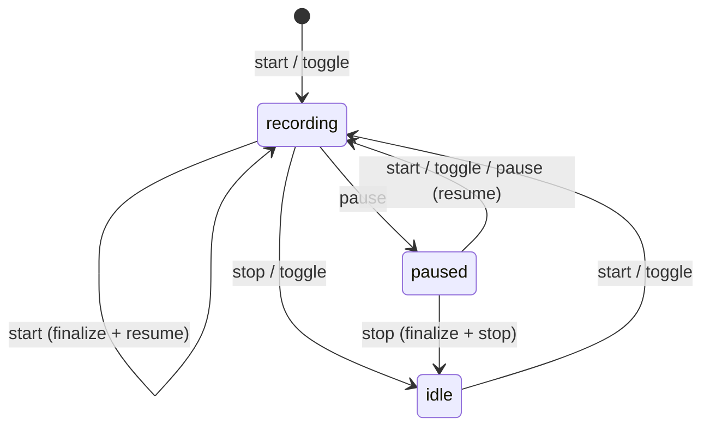

# Socket-Based Daemon Redesign

## Status

<!-- EXTREMELY IMPORTANT: Keep this section current. Update **BEFORE** every commit. -->

| Phase | Status | Notes |
|-------|--------|-------|
| Phase 0: Test infrastructure | **In progress** | Items 1-5 complete; items 6-7 not started |
| Phase A: Socket control plane | Not started | Blocked on Phase 0 gate |
| Phase B: External event ingestion | Not started | Blocked on Phase A |
| Phase C: Narration delivery | Not started | Blocked on Phase B |
| Phase D: Cleanup | Not started | Blocked on Phase C |
| Phase E: Gate test infrastructure | Not started | Blocked on Phase D |

Phase 0 item-level status: [Phase 0 Detail](phase-20-phase0.md#status)

### Bug fixes discovered during implementation

- `92f8cc7` — Fix vacuous empty-string match in clipboard dedup
- `c383639` — Fix cross-run clipboard dedup: promote to global pass
- `cd5c577` — Gate stub module behind `#[cfg(test)]`, document build verification
- `f68eaec` — Fix panic on multi-byte UTF-8 in editor snapshot annotation

## Subdocuments

| Document | Scope |
|----------|-------|
| [Phase 0 Detail](phase-20-phase0.md) | Items 1-7, existing traits, dependency order |
| [Test Infrastructure](phase-20-testing.md) | Oracle models, injection, ACK protocol, harness, proptest |

## Current architecture

This section describes how things work today, for context. If you're
already familiar with the codebase, skip to [Motivation](#motivation).

### What attend does

`attend` is a voice narration tool: the user speaks while working, and
their speech is transcribed and delivered to an AI coding agent (Claude
Code) as context. The user can also capture browser selections, shell
commands, editor state, and clipboard content alongside speech.

### Key source files

| Area | Files | Purpose |
|------|-------|---------|
| Daemon lifecycle | `src/narrate/record.rs` | Recording state machine, sentinel polling, spawn/idle/shutdown |
| Audio capture | `src/narrate/audio.rs` | cpal microphone input, sample accumulation |
| Transcription | `src/narrate/transcribe/` | Parakeet and Whisper engines, model download |
| Capture threads | `src/narrate/capture.rs` | Coordinates editor, diff, ext, clipboard threads |
| Editor capture | `src/narrate/editor_capture.rs` | Polls editor for files/cursors, dwell filtering |
| Diff capture | `src/narrate/diff_capture.rs` | Watches file mtimes for content changes |
| External capture | `src/narrate/ext_capture.rs` | macOS accessibility API for selections in other apps |
| Clipboard capture | `src/narrate/clipboard_capture.rs` | Polls system clipboard for text/image changes |
| Event merge | `src/narrate/merge.rs` | Combines all event streams into a narration |
| Narration rendering | `src/view/` | Renders events as markdown for the agent |
| Hook layer | `src/hook.rs`, `src/hook/` | Claude Code hook integration (PreToolUse, PostToolUse) |
| Listener | `src/narrate/receive/listen.rs` | Background process that blocks until narration is ready |
| Browser bridge | `src/cli/browser_bridge.rs` | Native messaging host for browser extension |
| Shell hooks | `src/cli/shell_hook.rs` | Captures shell commands (fish/zsh preexec/postexec) |
| CLI | `src/cli/narrate.rs` | CLI command dispatch (toggle, start, stop, pause, yank, status) |
| State/paths | `src/state.rs` | Cache dir, session IDs, listening state |
| Path constants | `src/narrate.rs` | All filesystem paths (sentinel, staging, pending, archive) |
| Chime | `src/narrate/chime.rs` | Audio feedback on start/stop |

### Daemon state machine



Note: `stop` while idle is a no-op.

**Behavior fix (Phase A):** In the current sentinel-based implementation,
`stop` while paused is a no-op because the pause sentinel and idle state
are conflated (same file). The socket redesign separates pause and idle
into distinct daemon-resident states, which lets `stop` from paused do
the right thing: finalize whatever was captured and transition to idle.
The diagram above reflects the intended behavior, not the current bug.

The daemon also supports `yank` (finalize + copy to clipboard instead of
writing to pending). The `start` command doubles as a flush: if already
recording, it finalizes and resumes.

### How narration reaches the agent

The full narration protocol — what the agent sees, how it should respond,
content trust rules, and lifecycle edge cases — is documented in
[`src/agent/messages/narration_protocol.md`](../src/agent/messages/narration_protocol.md).
That file is injected into the agent's context when `/attend` activates
narration. The key architectural points are below.

This is a multi-process dance driven by Claude Code's hook system:

1. **`/attend` slash command**: The user types `/attend` in Claude Code.
   The `user-prompt-submit` hook runs `attend hook user-prompt`, which
   detects the `/attend` prompt and writes the session ID to
   `~/.cache/attend/hooks/listening`. This is the "activation" step.
   (Note: `session-start` is a separate hook that fires on session
   creation — it handles initial setup, not `/attend` activation.)

2. **`attend listen`**: Claude Code runs this as a background task. It
   holds an exclusive lock (`hooks/receive.lock`) and polls
   `narration/pending/<session_id>/` every 500ms. When files appear, it
   exits silently. Its exit is the signal to Claude Code that narration
   is available.

3. **`attend hook pre-tool-use`**: On every tool use, Claude Code calls
   this hook. If pending narration exists, the hook reads the JSON files,
   renders them as markdown, and prints them to stdout. Claude Code
   injects this output into the agent's conversation. The hook then
   archives the pending files and restarts `attend listen` as a new
   background task.

4. **Session theft**: If the user types `/attend` in a different Claude
   Code session, the `listening` file is overwritten with the new session
   ID. The old `attend listen` detects this on its next poll and exits.

The critical subtlety: `attend listen` is a **signal flare, not a data
channel**. Its task output is always empty. It exists solely so that its
exit triggers a `<task-notification>` in the agent, which prompts the
agent to run `attend listen` again — and it's the PreToolUse hook on
*that* restart call where narration actually gets delivered. The protocol
doc describes this as the "core loop."

### Current IPC: sentinel files and staging directories

The daemon is controlled via zero-byte "sentinel" files in
`~/.cache/attend/daemon/`:

- `stop` — CLI writes, daemon polls at 100ms, flushes and enters idle
- `pause` — daemon writes when entering idle; CLI deletes to resume
- `flush` — CLI writes, daemon flushes without stopping
- `yank` — CLI writes, daemon finalizes to `yanked/` instead of `pending/`

External events (browser selections, shell commands) are staged as JSON
files in `~/.cache/attend/staging/{browser,shell}/<session_id>/`. The
daemon collects these on flush/stop and merges them with other events.

A PID-based lock file (`daemon/lock`) provides exclusive instance
detection. A separate lock (`hooks/receive.lock`) prevents duplicate
listeners.

### Event types

All captured data flows through a unified `Event` enum (defined in
`src/narrate/merge.rs`):

- `Words` — transcribed speech with timestamps
- `EditorSnapshot` — open files, cursors, selections
- `FileDiff` — old/new content of changed files
- `ExternalSelection` — text selected in other apps (accessibility)
- `BrowserSelection` — text selected in browser (native messaging)
- `ShellCommand` — command text, exit status, duration
- `ClipboardSelection` — clipboard text or image path

The merge pipeline combines events from all sources, deduplicates,
orders by timestamp, and produces a single narration JSON array.

**Filtering is deferred to delivery time.** The daemon writes all events
with absolute paths, unfiltered. When the hook process delivers narration,
it filters to the agent's working directory (and `include_dirs`), redacts
out-of-scope events as `✂` markers, and relativizes paths. This means the
archive contains the full unfiltered narration, while the agent only sees
what's in scope. The same narration can be delivered to agents in different
working directories with different views.

---

## Motivation

The current daemon uses sentinel files (zero-byte files polled at 100ms) for
control, staging directories for external event ingestion, and `pending/` JSON
files for narration delivery. This works but has three problems:

1. **TCC permission inheritance**: On macOS, the daemon inherits its
   "responsible process" from whichever app spawned it (Zed, iTerm2, Shortcuts).
   The user must grant microphone access to every app they trigger narration
   from. If `launchd` spawns the daemon instead, TCC attributes the mic
   permission to `attend` itself — grant once, works everywhere.

2. **Polling overhead and latency**: Sentinel files are polled at 100ms. The
   browser bridge and shell hooks write to staging directories that aren't
   collected until flush/stop. A socket gives instant command delivery and
   real-time event ingestion.

3. **Filesystem sprawl**: Seven cache subdirectories (daemon/, staging/browser/,
   staging/shell/, staging/clipboard/, narration/pending/, narration/yanked/,
   hooks/) with sentinel files, lock files, staging JSON, and session markers.
   A socket collapses most of this into in-memory state.

## Design

### The daemon as central hub

```
                    ┌──────────────────────────────────────────────┐
                    │              attend daemon                   │
                    │                                              │
                    │  In-process capture threads:                 │
                    │    audio ────┐                               │
                    │    editor ───┤                               │
                    │    diff ─────┤  in-memory                    │
                    │    ext ──────┤  event buffer ──→ transcribe │
                    │    clipboard ┘       ↑                       │
                    │                      │                       │
                    │  ┌───────────────────┴──────────────┐        │
                    │  │    socket: control.sock          │        │
                    │  └───────────────────┬──────────────┘        │
                    │                      │                       │
                    └──────────────────────┼───────────────────────┘
                                           │
         ┌─────────────────────────────────┼──────────────────────┐
         │              │                  │           │          │
      CLI tool    browser bridge      shell hook   listener   hook layer
      (recording  (sends selections)  (sends cmds) (Wait for  (Activate,
       control,                                     Ok)       Deactivate,
       status)                                                Collect,
                                                              Status)
```

All communication flows through a single Unix domain socket. The daemon
accepts multiple concurrent connections. Each connection sends a typed
message identifying itself and its intent.

### What moves to the socket

| Current mechanism | Replacement |
|-------------------|-------------|
| `daemon/stop` sentinel | `Command::Stop` message |
| `daemon/pause` sentinel | `Command::Pause` message |
| `daemon/flush` sentinel | `Command::Start` (flush if already recording) |
| `daemon/yank` sentinel | `Command::Yank` message |
| `daemon/lock` (PID file) | Socket bind exclusivity |
| `hooks/listening` (session file) | Daemon-resident state; queried via socket |
| `hooks/receive.lock` | At most one `Wait` connection from listener |
| `staging/browser/*.json` | `Command::BrowserSelection` sent over socket |
| `staging/shell/*.json` | `Command::ShellCommand` sent over socket |
| `narration/pending/*.json` | `Command::Collect` retrieves directly from daemon |
| Status queries (read various files) | `Command::Status` → `Response::Status` |

### What stays on the filesystem

| Item | Why |
|------|-----|
| Model cache (~1.2 GB ONNX/GGML) | Cold storage, downloaded once |
| `narration/archive/` | Persistent history across daemon restarts |
| Config files (TOML) | User-edited, hierarchical |
| `version.json` (install metadata) | Written by `attend install`, read at startup |
| Clipboard image staging | Large PNGs; reference by path in events, clean up on archive |

### Narration delivery without pending files

Today, the daemon writes JSON to `pending/<session_id>/`. Delivery is a
two-process dance: `attend listen` is a background process that blocks
(holding `receive.lock`) until pending files appear, then exits. The actual
reading and delivery happens in the `attend hook pre-tool-use` process, which
runs synchronously in the agent's context — it reads the pending files,
renders them as markdown, and injects them into the agent's conversation.

With sockets, the listener's role stays the same — it's a poke that exits
when narration is available — but the mechanism changes from filesystem
polling to a blocking socket read:

1. `attend listen` connects to the daemon socket and sends
   `Command::Wait`. It does not know or send a session ID.
2. The daemon holds this connection open.
3. When narration is ready (stop or start-while-recording), the
   daemon sends `Response::Ok` to the waiting connection.
4. `attend listen` receives `Ok` and exits, causing the agent framework
   to fire the next tool use.
5. The hook process (`attend hook pre-tool-use`) connects to the daemon
   and sends `Command::Collect { session_id }` to retrieve the narration
   content directly — no filesystem intermediary. The hook knows the
   session ID because the agent framework passes it.

Session-theft detection is handled by the daemon: when a new session
activates (via `/attend`), the daemon closes any existing `Wait`
connection, causing the old listener to exit. Duplicate listener
prevention is enforced by the daemon allowing at most one `Wait`
connection at a time.

The daemon buffers finalized narration in memory until a `Collect` retrieves
it. The daemon stays resident (never exits from idle — it only unloads the
model), so buffered narration is only lost on crash.

This preserves the current two-process delivery model (listener pokes,
hook delivers) while eliminating filesystem polling.

### Yank without staging

Today, yank writes to `yanked/`, the parent CLI reads it back and copies to
clipboard. With sockets, the daemon handles everything:

1. CLI sends `Command::Yank`.
2. Daemon finalizes, transcribes, copies to clipboard directly (via
   `arboard`), and responds with `Response::Ok`.

No filesystem round-trip, no `yanked/` directory.

### Edge-case responses

- **`Collect` when nothing is buffered**: responds with
  `Narration { events: [] }` (empty array, not an error). The hook
  renders nothing and the agent sees no narration.
- **`Wait` when narration is already buffered**: responds with `Ok`
  immediately (no blocking). The listener exits, the hook collects.
- **`Toggle` when daemon has no active session**: starts recording
  without a session. Narration is buffered until a session activates
  and `Collect` is called.
- **`Yank` when not recording**: no-op, responds with `Ok`.

---

## Resolved decisions

1. **Clipboard images stay on disk.** Claude needs to read them by path.
   Image staging files remain in the filesystem; events reference them by
   path. Only text/metadata flows over the socket.

2. **Single listener only.** No multi-agent support. One session, one
   listener. `attend listen` does not activate a session — the `/attend`
   hook must be explicitly run first. Session stealing by running
   `attend listen` is not permitted.

3. **Cross-platform socket activation.** Use `service-binding` crate for
   both macOS (launchd) and Linux (systemd). Same daemon code path on both
   platforms, reducing variance. Service definitions are auto-managed on
   both platforms (no manual install step).

4. **Session state moves into the daemon.** The `sessions/` marker files
   (`displaced/`, `activated/`, `cache/`) are replaced by daemon-resident
   state. The hook process queries the daemon via socket instead of reading
   files. This means the daemon must stay resident (see below).

5. **Daemon stays resident, unloads model.** The daemon does not exit after
   idle timeout. It stays alive to hold session state and accept connections.
   After a dormancy period (configurable, default 5m), it unloads the
   transcription model to reclaim RAM (~1.2 GB for Parakeet, ~466 MB for
   Whisper). Both models are fully heap-allocated (not mmap'd), so the OS
   cannot reclaim them without swap — explicit unload is necessary for
   predictable memory behavior, especially on 8 GB machines.

   Unloading is straightforward: the transcriber is wrapped in an `Option`
   and set to `None` after dormancy. The underlying C libraries
   (`onnxruntime`, `whisper.cpp`) free their allocations via `Drop`. The
   model is re-loaded (~2-3s) on the next recording start. Socket, session
   state, and capture thread infrastructure remain live.

6. **Daemon archives before delivering.** On `Collect`, the daemon writes
   the narration to `archive/` first, then sends it to the hook. If the
   hook crashes after receiving, the narration is already persisted. No
   data loss window.

7. **Version field on every request.** Every `Request` struct carries a
   `version` field: the **git commit hash** baked into the binary at build
   time (via `vergen-gitcl`). The daemon checks it before processing; on
   mismatch it stops accepting connections, responds with `Error`, and shuts
   down. The service manager respawns it from the current binary. The
   client retries once.

   This also means `version.json` (install metadata) should use the commit
   hash instead of the cargo semver version, so all version checks are
   consistent.

   No separate handshake step — version checking is just part of every
   request. Single round-trip, no overhead.

---

## Protocol

### Framing

None. Each connection is a single round-trip: one request JSON object,
one response JSON object. `serde_json::to_writer()` /
`serde_json::from_reader()` directly on the `UnixStream`. No length
prefix, no newline delimiters, no framing code. Debuggable with `socat`.

### Serialization

`serde_json` in compact mode. Rationale:

- No cross-version compatibility needed (CLI and daemon are the same binary).
- JSON is inspectable with `socat` / `jq` during development.
- The messages are small (commands are tens of bytes; narration events are
  at most a few KB). Serialization speed is not a bottleneck.
- `serde_json` is already a dependency.

If profiling later shows serialization overhead matters (unlikely for control
plane; conceivable for high-frequency narration streaming), `postcard` is a
drop-in replacement (same serde derives, binary format, ~30% smaller messages).

### Message types

```rust
/// Client → Daemon
///
/// Every request carries the client's commit hash. The daemon checks
/// it before processing; on mismatch it responds with Error, stops
/// accepting new connections, and shuts down. The client retries once
/// (the service manager respawns the daemon from the current binary).
#[derive(Serialize, Deserialize)]
struct Request {
    version: String,  // git commit hash
    command: Command,
}

#[derive(Serialize, Deserialize)]
enum Command {
    // Recording control
    Toggle,  // context-dependent: starts if idle, stops if recording
    Start,   // starts if idle, flushes (finalize + resume) if recording
    Stop,    // no-op if idle
    Pause,   // toggles pause state
    Yank,

    // External events
    BrowserSelection {
        url: String,
        title: String,
        html: String,
        plain_text: Option<String>,
    },
    ShellCommand {
        shell: String,
        command: String,
        cwd: String,
        exit_status: Option<i32>,
        duration_secs: Option<f64>,
    },

    // Session management (from hook layer)
    ActivateSession { session_id: String },
    DeactivateSession { session_id: String },

    // Listener: block until narration is ready (no session ID needed)
    Wait,

    // Hook: collect pending narration for delivery
    Collect { session_id: String },

    // Queries
    Status,
}

/// Daemon → Client
#[derive(Serialize, Deserialize)]
enum Response {
    // Success. The CLI interprets this based on what it sent.
    Ok,

    // Failure (including version mismatch).
    Error { message: String },

    // Collected narration content (response to Collect)
    Narration { events: Vec<Event> },

    // Full status report (response to Status)
    Status { /* fields from current status.rs */ },
}
```

### Version handshake

Every request carries a `version` field (the client's commit hash). The
daemon checks it before processing the command:

- Match: process the command normally.
- Mismatch: stop accepting new connections, ONLY THEN respond with `Error`, and
  shut down. The service manager respawns the daemon from the current
  binary. The client retries once.

The commit hash is baked in at build time via `vergen-gitcl`, which
shells out to `git` and emits cargo env vars (e.g. `VERGEN_GIT_SHA`)
accessible via `env!()`. When git is unavailable (e.g. tarball builds),
`vergen-gitcl` emits default values and warnings rather than failing
the build. For dev builds without a clean tag, `VERGEN_GIT_DESCRIBE`
provides the equivalent of `git describe --always --dirty`.

No special handshake step — version checking is just part of every
request.

### Connection patterns

| Client | Pattern | Lifecycle |
|--------|---------|-----------|
| `attend narrate toggle` | Connect → send `Toggle` → receive `Ok` → disconnect | Ephemeral |
| `attend narrate start` | Connect → send `Start` → receive `Ok` → disconnect | Ephemeral |
| `attend narrate stop` | Connect → send `Stop` → receive `Ok` → disconnect | Ephemeral |
| `attend narrate pause` | Connect → send `Pause` → receive `Ok` → disconnect | Ephemeral |
| `attend narrate yank` | Connect → send `Yank` → receive `Ok` (daemon copies to clipboard) → disconnect | Ephemeral |
| `attend narrate status` | Connect → send `Status` → receive `Status` → disconnect | Ephemeral |
| `attend browser-bridge` | Connect → send `BrowserSelection` → receive `Ok` → disconnect | Ephemeral |
| `attend shell-hook` | Connect → send `ShellCommand` → receive `Ok` → disconnect | Ephemeral |
| `attend listen` | Connect → send `Wait` → block until `Ok` → disconnect | Long-lived (blocking) |
| `attend hook pre-tool-use` | Connect → send `Collect` → receive `Narration` → disconnect | Ephemeral |
| `/attend` hook | Connect → send `ActivateSession` → receive `Ok` → disconnect | Ephemeral |
| `/unattend` hook | Connect → send `DeactivateSession` → receive `Ok` → disconnect | Ephemeral |

Every connection is a single round-trip: one request, one response. For
`Wait`, the response is simply delayed until narration is ready.

---

## Daemon lifecycle

### Startup

On both platforms, the service manager (launchd on macOS, systemd on
Linux) is auto-managed. The `service-binding` crate provides a unified
interface for socket activation across both.

1. The service definition (plist or systemd unit) is auto-installed (see
   service management section).
2. The service manager creates `control.sock` and listens on it.
3. First client connects → service manager spawns `attend narrate _daemon`.
4. Daemon calls `service-binding` to receive the activated socket fd.
5. Converts to `UnixListener` and begins accepting connections.

**Fallback (no service manager)**: If socket activation fails (e.g., no
systemd on a minimal Linux), the CLI spawns the daemon directly with
`process_group(0)` + detached stdio. The daemon creates the socket itself.

### Socket path

`$CACHE_DIR/daemon/control.sock`

On macOS: `~/Library/Caches/attend/daemon/control.sock`
On Linux: `$XDG_CACHE_HOME/attend/daemon/control.sock` (typically
`~/.cache/attend/daemon/control.sock`)

### Idle and model unloading

The daemon stays resident indefinitely. It does not exit on idle — it holds
session state and accepts connections at all times. After a dormancy period
(configurable, default 5m) with no active recording, the daemon unloads the
transcription model to reclaim RAM. The model is re-loaded on the next
recording start.

The daemon only exits on:
- Version mismatch (client has a newer commit hash)
- Explicit `attend uninstall`
- Crash (service manager restarts it)

### Exclusive instance

Socket bind is itself an exclusive lock — if the socket path exists and is
bound, `bind()` fails with `EADDRINUSE`. This replaces the PID lock file.

Stale socket detection (fallback path only — service managers handle
restarts automatically): if `connect()` to an existing socket fails with
`ECONNREFUSED`, the daemon has crashed without cleaning up. The CLI removes
the stale socket and spawns a new daemon.

---

## Service management (cross-platform)

### macOS: LaunchAgent plist

```xml
<?xml version="1.0" encoding="UTF-8"?>
<!DOCTYPE plist PUBLIC "-//Apple//DTD PLIST 1.0//EN"
  "http://www.apple.com/DTDs/PropertyList-1.0.dtd">
<plist version="1.0">
<dict>
    <key>Label</key>
    <string>com.attend.daemon</string>
    <key>ProgramArguments</key>
    <array>
        <string>ATTEND_BIN_PATH</string>
        <string>narrate</string>
        <string>_daemon</string>
    </array>
    <key>Sockets</key>
    <dict>
        <key>attend</key>
        <dict>
            <key>SockFamily</key>
            <string>Unix</string>
            <key>SockPathName</key>
            <string>SOCKET_PATH</string>
        </dict>
    </dict>
</dict>
</plist>
```

`ATTEND_BIN_PATH` and `SOCKET_PATH` are templated at install time.

### Auto-managed (no separate install step)

On macOS, launchd management is the only mode of operation — there is no
`--daemon` flag or opt-in. Any CLI command that needs the daemon (toggle,
pause, yank, status) ensures the plist is installed and current before
connecting to the socket:

1. Read the installed plist (if any) from `~/Library/LaunchAgents/`.
2. Compare the `ProgramArguments` path against the current `attend` binary
   (`std::env::current_exe()`).
3. If missing or stale (binary path changed after upgrade/reinstall):
   - Write the new plist.
   - `launchctl bootout` the old service (if loaded).
   - `launchctl bootstrap` the new one.
4. Connect to the socket. launchd spawns the daemon automatically on
   first connect — there is no explicit "start daemon" step.

This is silent and automatic. `attend uninstall` removes the plist and
runs `launchctl bootout` as part of full cleanup.

### Linux: systemd user service

Two unit files: a `.socket` (holds the socket) and a `.service` (runs the
daemon when activated):

```ini
# ~/.config/systemd/user/attend-daemon.socket
[Unit]
Description=attend daemon socket

[Socket]
ListenStream=SOCKET_PATH
SocketMode=0600

[Install]
WantedBy=sockets.target
```

```ini
# ~/.config/systemd/user/attend-daemon.service
[Unit]
Description=attend narration daemon
Requires=attend-daemon.socket

[Service]
Type=simple
ExecStart=ATTEND_BIN_PATH narrate _daemon
```

`ATTEND_BIN_PATH` and `SOCKET_PATH` are templated at install time (same
as the macOS plist).

Same auto-management pattern. Any CLI command that needs the daemon ensures
the systemd user service is installed and current:

1. Check `~/.config/systemd/user/attend-daemon.service` and
   `attend-daemon.socket`.
2. If missing or stale: write units, `systemctl --user daemon-reload`,
   `systemctl --user enable --now attend-daemon.socket`.
3. Connect to the socket. systemd spawns the daemon on first connect.

`attend uninstall` disables and removes the units.

### TCC effect

Because `launchd` spawns the daemon, TCC attributes microphone access and
accessibility permissions to the `attend` binary. The user grants access once
(on first recording start), and it works regardless of which app triggered the
hotkey.

---

## Crate choices

| Purpose | Crate | Notes |
|---------|-------|-------|
| Socket listener | `std::os::unix::net::UnixListener` | No async runtime needed |
| Framing | None | One JSON object per connection; `serde_json` reads/writes directly |
| Serialization | `serde_json` | Already a dependency; debuggable; swap to `postcard` later if needed |
| Socket activation | `service-binding` | Cross-platform: launchd (macOS) and systemd (Linux) |
| Service unit mgmt | Hand-rolled (template + write) | Plist and systemd units are static with templated paths |
| Build-time commit hash | `vergen-gitcl` | Shells out to `git` (no C deps); graceful fallback when git unavailable |

### No async runtime

The daemon is CPU-bound (transcription) and I/O-bound on platform APIs (cpal,
accessibility) that are inherently synchronous. The control plane has at most
a handful of concurrent connections — usually just one. There is no workload
here that benefits from async.

A dedicated acceptor thread calls `listener.accept()` in a loop. Ephemeral
connections (command → response) are handled inline on the acceptor thread.
The one long-lived connection (`Wait`) gets its own thread that blocks on a
channel receiver until the daemon signals readiness. No tokio, no futures,
no async runtime overhead.

### Settlement tracking for the acceptor thread

The acceptor thread must participate in the MockClock settlement
protocol. Commands like `Toggle`, `Stop`, `Pause`, and
`ActivateSession` mutate daemon state that capture threads observe. If
the acceptor runs outside settlement, a capture thread could observe a
state change mid-tick, breaking determinism.

The acceptor thread should use `clock.for_thread()` to get a
`ParticipantMockClock` (departure tracking on exit) and bracket its
`accept()` call with `clock.park()` (settled while waiting for a
connection, expected += 1 when a connection arrives). This way
`advance_and_settle()` won't return until the acceptor has finished
processing any in-flight command and is back waiting on `accept()`.

The harness controls when commands are sent relative to time advances,
so it can choose to send a command before or after an advance. Settlement
guarantees the command is fully processed before the next tick begins.

The `Wait` thread similarly needs settlement tracking: `park()` around
its channel `recv()`, so settlement knows it's blocked and not
mid-processing.

Note: `clippy.toml` already flags `UnixListener::accept`,
`Receiver::recv`, and bare condvar waits as `disallowed_methods`. The
acceptor and wait threads will need `#[allow(clippy::disallowed_methods)]`
annotations with comments confirming they are park-guarded.

---

## Migration path

Red-green is the north star. Both oracle suites must pass against the
current implementation before any functional changes begin. Each subsequent
phase is: make the change, get back to green.

### Phase 0: Test infrastructure and oracle suites

**No functional changes.** See [Phase 0 Detail](phase-20-phase0.md) for
items, dependency order, and existing traits. See
[Test Infrastructure](phase-20-testing.md) for the oracle and harness
specifications.

**Gate**: both oracle suites pass reliably before proceeding.

### Phase A: Socket control plane

Replace sentinel files with socket-based commands. The daemon listens on a
Unix domain socket. CLI commands (`toggle`, `start`, `stop`, `pause`, `yank`)
connect and send typed messages instead of writing sentinel files.

- Lock file → socket bind exclusivity
- Sentinel polling loop → socket accept loop (blocking or select-based)
- `attend narrate status` → queries daemon over socket
- Version handshake on every connection (commit hash)
- `version.json` switches from cargo semver to commit hash
- Service manager auto-management on macOS (launchd) and Linux (systemd)
- **Behavior fix:** `stop` while paused now finalizes and stops (was a
  no-op due to pause/idle sentinel conflation; separate daemon-resident
  states fix this)
- Staging directories for browser/shell remain (Phase B)
- `pending/` files remain (Phase C)

**Gate**: both oracle suites pass green.

### Phase B: External event ingestion

Browser bridge and shell hooks send events directly to the daemon socket
instead of writing to staging directories.

- `staging/browser/` eliminated
- `staging/shell/` eliminated
- Events are merged in real-time (no deferred collection on stop)
- Timestamps come from the event itself, not from file mtime
- With a service manager (launchd or systemd), the socket is always
  available; connecting wakes the daemon. On the fallback path (no service
  manager), if the daemon isn't running, the event is dropped — there's
  no active narration session to deliver it to.

**Gate**: both oracle suites pass green.

### Phase C: Narration delivery and session state over socket

`attend listen` blocks on a `Wait` command instead of polling the filesystem.
The hook process collects narration via `Collect` instead of reading
`pending/` files. Session state moves into the daemon.

- `hooks/receive.lock` → at most one `Wait` connection
- `attend listen` filesystem poll → `Wait` on socket, exits on `Ok`
- Hook `collect_pending()` from files → `Collect` over socket
- Daemon buffers finalized narration in memory until `Collect`
- Daemon archives narration before delivering to hook
- `sessions/` markers replaced by daemon-resident state
- Daemon stays resident, unloads model after dormancy period

**Gate**: both oracle suites pass green.

### Phase D: Cleanup

- Remove dead code for sentinel file handling, staging directory management,
  lock file creation
- Remove now-unused cache subdirectories (`staging/`, `narration/pending/`,
  `narration/yanked/`, `sessions/`)
- Update `docs/setup.md` and troubleshooting
- Update `attend narrate status` output (socket path, connection state)

**Gate**: both oracle suites pass green.

### Phase E: Gate test infrastructure behind feature flag

All test-mode infrastructure in the `attend` crate is currently activated
by the `ATTEND_TEST_MODE=1` env var at runtime. This means every release
binary carries dead code for mock clocks, stub capture sources, inject
socket clients, etc. Phase E converts these runtime checks to
compile-time `#[cfg(feature = "test-mode")]` gates so that release builds
contain none of this code.

Add a `test-mode` Cargo feature to the `attend` crate. Gate behind it:

- `MockClock` and condvar-gated sleep infrastructure
- Inject socket client (connects to `test-inject.sock` at startup)
- Stub capture sources (`StubTranscriber`, stub `EditorStateSource`,
  stub `ExternalSource`, stub `ClipboardSource`)
- Stub clipboard write (yank output to file instead of system clipboard)
- `ATTEND_TEST_MODE` env var checking
- `CaptureConfig::test_mode()` constructor

**Keep ungated** (useful in production):

- `ATTEND_CACHE_DIR` env var override (users may want a custom cache
  location)

**Build workflow after this phase:**

```bash
# Optimized binary for oracle testing
cargo build --release --features test-mode

# Clean release binary (no test infrastructure)
cargo build --release
```

The oracle binaries and integration tests enable the feature via
Cargo dependency (`attend = { features = ["test-mode"] }`) or by
building the binary under test with `--features test-mode`.

**Verification:**

- `cargo build --release` produces a binary where `ATTEND_TEST_MODE=1`
  has no effect (all test code paths compiled out)
- Both oracle suites pass with `--features test-mode` enabled
- Binary size comparison: release vs release+test-mode, to confirm
  dead code is actually eliminated

**Gate**: both oracle suites pass green with `--features test-mode`.
Release binary builds clean without the feature. Final audit.

Note: [`narration_protocol.md`](../src/agent/messages/narration_protocol.md)
should **not** need changes. The agent-facing behavior is identical:
`attend listen` still exits to signal readiness, the PreToolUse hook
still delivers narration on stdout. The socket is entirely below the
agent's abstraction boundary.

---

## Agent handoff

This project is too large for a single agent context window. Each phase
(and likely each numbered item within Phase 0) will be a separate agent
session. To enable clean handoff:

1. **These documents are the source of truth.** The implementing agent
   should read this file and the relevant subdocument first. They contain
   the full design, all resolved decisions, and the migration ordering.
   **Always plan in these files, never in ephemeral agent plan mode.**
   Committing plans to the repo ensures state persists across agent
   sessions and is reviewable by humans. When something needs planning,
   update these documents directly.

2. **Phase status tracker.** The [Status](#status) section at the top of
   this file tracks phase-level progress. Item-level progress is in
   [Phase 0 Detail](phase-20-phase0.md#status). **Update after every
   commit** — check off completed items with their commit hash, update
   the phase status, and log bug fixes. The next agent reads these
   sections first to understand where things stand.

3. **Per-phase notes.** When a phase is in progress, keep a short log of
   implementation decisions and deviations at the bottom of the relevant
   document under a "## Implementation notes" heading. The next agent
   reads these to understand what was done and why.

4. **Commit frequently.** Each trait extraction, each stub, each oracle
   invariant should be its own commit. This gives the next agent a clear
   `git log` to understand progress.

   **Build verification before every commit.** Use `cargo nextest run`
   (not `cargo test`) as the test runner. Run the full `cargo clippy`
   and `cargo nextest run` output **unfiltered** — no `| tail`, `| head`,
   `| grep`, or other pipes that could hide warnings or failures. Zero
   clippy warnings, zero test failures. Proptest suites are
   nondeterministic by design: a test that passed on the last run can
   fail on the next with a different seed. Always check the full output,
   and if a proptest failure appears, investigate it — it may be a
   pre-existing issue surfaced by a new seed, or it may be a regression
   you introduced. Either way, fix it before committing.

   **Never delete proptest regression files.** The `proptest-regressions/`
   directory contains seed files that reproduce past failures. Proptest
   automatically replays these seeds before generating new cases —
   they're a permanent regression suite. Always commit new regression
   entries alongside the fix. Never remove entries, even if you believe
   the underlying issue is fixed — the seeds are cheap and serve as
   regression guards forever.

5. **CLAUDE.md / memory.** Update the project memory file with the current
   phase and any gotchas discovered during implementation.

6. **Existing tests are a friend, not an obstacle.** All existing tests
   should be assumed correct in *intent*. They may need mild syntactic
   adaptation to work with the new architecture (e.g., a trait parameter
   added, a mock injected), but their invariants should never be relaxed.
   If a test fails after a change, the default assumption is that the
   change is wrong, not the test. If investigation reveals a genuine bug
   in the current implementation, fix it — but be cautious and discerning.
   Every test modification should be in the spirit of greater rigor,
   never relaxing invariants in the name of expediency. This applies
   equally to tests written during this project: once green, they are
   the new baseline.

## Open questions

None at this time. All major design decisions are resolved above.

---

## Appendix: `responsibility_spawnattrs_setdisclaim()`

This private macOS API could break the TCC responsible-process chain without
requiring a LaunchAgent. It still works on Sequoia 15.x and is used by LLDB,
Qt Creator, and Facebook's sado project. Ghostty evaluated and rejected it,
but their concern (shells as privilege escalation trampolines) doesn't apply
to us: our daemon is a bounded, known binary, not an arbitrary-code executor.

However, the service-manager approach is strictly better:
- Supported, public API
- Gives us on-demand activation for free
- Does not require `unsafe` `posix_spawn` calls
- The socket-based architecture is independently valuable
- Works cross-platform (systemd on Linux, not just macOS)

Documented here for posterity. Not planned for use.
