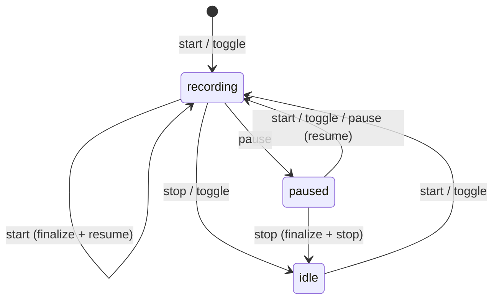

# Socket-Based Daemon Redesign

## Status

<!-- EXTREMELY IMPORTANT: Keep this section current. Update **BEFORE** every commit. -->

| Phase | Status | Notes |
|-------|--------|-------|
| Phase 0: Test infrastructure | **In progress** | Items 1-5 complete; items 6-7 not started |
| Phase A: Socket control plane | Not started | Blocked on Phase 0 gate |
| Phase B: External event ingestion | Not started | Blocked on Phase A |
| Phase C: Narration delivery | Not started | Blocked on Phase B |
| Phase D: Cleanup | Not started | Blocked on Phase C |
| Phase E: Gate test infrastructure | Not started | Blocked on Phase D |

### Phase 0 items

- [x] 1. Trait extraction — `3c4f05b`, `69553a6`, `023c84d`, `6ccb168`
- [x] 2. `StubTranscriber` — `3ca31b6`
- [x] 3. Clock trait and `Instant` elimination — `f2a4bf0`, `f15470a`, `633404f`, `f736e38`
- [x] 4. `ATTEND_TEST_MODE` / `ATTEND_CACHE_DIR` / inject socket — `6b1d1b0`..`3215798` (8 commits)
- [x] 5. End-to-end test harness — `086fac1`..`6722d81` (3 commits)
- [ ] 6. Differential oracle (shared run infrastructure + self-diff)
- [ ] 7. Declarative oracle (invariant assertions on RunTrace)

### Bug fixes discovered during implementation

- `92f8cc7` — Fix vacuous empty-string match in clipboard dedup
- `c383639` — Fix cross-run clipboard dedup: promote to global pass
- `cd5c577` — Gate stub module behind `#[cfg(test)]`, document build verification
- `f68eaec` — Fix panic on multi-byte UTF-8 in editor snapshot annotation

## Current architecture

This section describes how things work today, for context. If you're
already familiar with the codebase, skip to [Motivation](#motivation).

### What attend does

`attend` is a voice narration tool: the user speaks while working, and
their speech is transcribed and delivered to an AI coding agent (Claude
Code) as context. The user can also capture browser selections, shell
commands, editor state, and clipboard content alongside speech.

### Key source files

| Area | Files | Purpose |
|------|-------|---------|
| Daemon lifecycle | `src/narrate/record.rs` | Recording state machine, sentinel polling, spawn/idle/shutdown |
| Audio capture | `src/narrate/audio.rs` | cpal microphone input, sample accumulation |
| Transcription | `src/narrate/transcribe/` | Parakeet and Whisper engines, model download |
| Capture threads | `src/narrate/capture.rs` | Coordinates editor, diff, ext, clipboard threads |
| Editor capture | `src/narrate/editor_capture.rs` | Polls editor for files/cursors, dwell filtering |
| Diff capture | `src/narrate/diff_capture.rs` | Watches file mtimes for content changes |
| External capture | `src/narrate/ext_capture.rs` | macOS accessibility API for selections in other apps |
| Clipboard capture | `src/narrate/clipboard_capture.rs` | Polls system clipboard for text/image changes |
| Event merge | `src/narrate/merge.rs` | Combines all event streams into a narration |
| Narration rendering | `src/view/` | Renders events as markdown for the agent |
| Hook layer | `src/hook.rs`, `src/hook/` | Claude Code hook integration (PreToolUse, PostToolUse) |
| Listener | `src/narrate/receive/listen.rs` | Background process that blocks until narration is ready |
| Browser bridge | `src/cli/browser_bridge.rs` | Native messaging host for browser extension |
| Shell hooks | `src/cli/shell_hook.rs` | Captures shell commands (fish/zsh preexec/postexec) |
| CLI | `src/cli/narrate.rs` | CLI command dispatch (toggle, start, stop, pause, yank, status) |
| State/paths | `src/state.rs` | Cache dir, session IDs, listening state |
| Path constants | `src/narrate.rs` | All filesystem paths (sentinel, staging, pending, archive) |
| Chime | `src/narrate/chime.rs` | Audio feedback on start/stop |

### Daemon state machine



Note: `stop` while idle is a no-op.

**Behavior fix (Phase A):** In the current sentinel-based implementation,
`stop` while paused is a no-op because the pause sentinel and idle state
are conflated (same file). The socket redesign separates pause and idle
into distinct daemon-resident states, which lets `stop` from paused do
the right thing: finalize whatever was captured and transition to idle.
The diagram above reflects the intended behavior, not the current bug.

The daemon also supports `yank` (finalize + copy to clipboard instead of
writing to pending). The `start` command doubles as a flush: if already
recording, it finalizes and resumes.

### How narration reaches the agent

The full narration protocol — what the agent sees, how it should respond,
content trust rules, and lifecycle edge cases — is documented in
[`src/agent/messages/narration_protocol.md`](../src/agent/messages/narration_protocol.md).
That file is injected into the agent's context when `/attend` activates
narration. The key architectural points are below.

This is a multi-process dance driven by Claude Code's hook system:

1. **`/attend` slash command**: The user types `/attend` in Claude Code.
   The `user-prompt-submit` hook runs `attend hook user-prompt`, which
   detects the `/attend` prompt and writes the session ID to
   `~/.cache/attend/hooks/listening`. This is the "activation" step.
   (Note: `session-start` is a separate hook that fires on session
   creation — it handles initial setup, not `/attend` activation.)

2. **`attend listen`**: Claude Code runs this as a background task. It
   holds an exclusive lock (`hooks/receive.lock`) and polls
   `narration/pending/<session_id>/` every 500ms. When files appear, it
   exits silently. Its exit is the signal to Claude Code that narration
   is available.

3. **`attend hook pre-tool-use`**: On every tool use, Claude Code calls
   this hook. If pending narration exists, the hook reads the JSON files,
   renders them as markdown, and prints them to stdout. Claude Code
   injects this output into the agent's conversation. The hook then
   archives the pending files and restarts `attend listen` as a new
   background task.

4. **Session theft**: If the user types `/attend` in a different Claude
   Code session, the `listening` file is overwritten with the new session
   ID. The old `attend listen` detects this on its next poll and exits.

The critical subtlety: `attend listen` is a **signal flare, not a data
channel**. Its task output is always empty. It exists solely so that its
exit triggers a `<task-notification>` in the agent, which prompts the
agent to run `attend listen` again — and it's the PreToolUse hook on
*that* restart call where narration actually gets delivered. The protocol
doc describes this as the "core loop."

### Current IPC: sentinel files and staging directories

The daemon is controlled via zero-byte "sentinel" files in
`~/.cache/attend/daemon/`:

- `stop` — CLI writes, daemon polls at 100ms, flushes and enters idle
- `pause` — daemon writes when entering idle; CLI deletes to resume
- `flush` — CLI writes, daemon flushes without stopping
- `yank` — CLI writes, daemon finalizes to `yanked/` instead of `pending/`

External events (browser selections, shell commands) are staged as JSON
files in `~/.cache/attend/staging/{browser,shell}/<session_id>/`. The
daemon collects these on flush/stop and merges them with other events.

A PID-based lock file (`daemon/lock`) provides exclusive instance
detection. A separate lock (`hooks/receive.lock`) prevents duplicate
listeners.

### Event types

All captured data flows through a unified `Event` enum (defined in
`src/narrate/merge.rs`):

- `Words` — transcribed speech with timestamps
- `EditorSnapshot` — open files, cursors, selections
- `FileDiff` — old/new content of changed files
- `ExternalSelection` — text selected in other apps (accessibility)
- `BrowserSelection` — text selected in browser (native messaging)
- `ShellCommand` — command text, exit status, duration
- `ClipboardSelection` — clipboard text or image path

The merge pipeline combines events from all sources, deduplicates,
orders by timestamp, and produces a single narration JSON array.

**Filtering is deferred to delivery time.** The daemon writes all events
with absolute paths, unfiltered. When the hook process delivers narration,
it filters to the agent's working directory (and `include_dirs`), redacts
out-of-scope events as `✂` markers, and relativizes paths. This means the
archive contains the full unfiltered narration, while the agent only sees
what's in scope. The same narration can be delivered to agents in different
working directories with different views.

---

## Motivation

The current daemon uses sentinel files (zero-byte files polled at 100ms) for
control, staging directories for external event ingestion, and `pending/` JSON
files for narration delivery. This works but has three problems:

1. **TCC permission inheritance**: On macOS, the daemon inherits its
   "responsible process" from whichever app spawned it (Zed, iTerm2, Shortcuts).
   The user must grant microphone access to every app they trigger narration
   from. If `launchd` spawns the daemon instead, TCC attributes the mic
   permission to `attend` itself — grant once, works everywhere.

2. **Polling overhead and latency**: Sentinel files are polled at 100ms. The
   browser bridge and shell hooks write to staging directories that aren't
   collected until flush/stop. A socket gives instant command delivery and
   real-time event ingestion.

3. **Filesystem sprawl**: Seven cache subdirectories (daemon/, staging/browser/,
   staging/shell/, staging/clipboard/, narration/pending/, narration/yanked/,
   hooks/) with sentinel files, lock files, staging JSON, and session markers.
   A socket collapses most of this into in-memory state.

## Design

### The daemon as central hub

```
                    ┌──────────────────────────────────────────────┐
                    │              attend daemon                   │
                    │                                              │
                    │  In-process capture threads:                 │
                    │    audio ────┐                               │
                    │    editor ───┤                               │
                    │    diff ─────┤  in-memory                    │
                    │    ext ──────┤  event buffer ──→ transcribe │
                    │    clipboard ┘       ↑                       │
                    │                      │                       │
                    │  ┌───────────────────┴──────────────┐        │
                    │  │    socket: control.sock          │        │
                    │  └───────────────────┬──────────────┘        │
                    │                      │                       │
                    └──────────────────────┼───────────────────────┘
                                           │
         ┌─────────────────────────────────┼──────────────────────┐
         │              │                  │           │          │
      CLI tool    browser bridge      shell hook   listener   hook layer
      (recording  (sends selections)  (sends cmds) (Wait for  (Activate,
       control,                                     Ok)       Deactivate,
       status)                                                Collect,
                                                              Status)
```

All communication flows through a single Unix domain socket. The daemon
accepts multiple concurrent connections. Each connection sends a typed
message identifying itself and its intent.

### What moves to the socket

| Current mechanism | Replacement |
|-------------------|-------------|
| `daemon/stop` sentinel | `Command::Stop` message |
| `daemon/pause` sentinel | `Command::Pause` message |
| `daemon/flush` sentinel | `Command::Start` (flush if already recording) |
| `daemon/yank` sentinel | `Command::Yank` message |
| `daemon/lock` (PID file) | Socket bind exclusivity |
| `hooks/listening` (session file) | Daemon-resident state; queried via socket |
| `hooks/receive.lock` | At most one `Wait` connection from listener |
| `staging/browser/*.json` | `Command::BrowserSelection` sent over socket |
| `staging/shell/*.json` | `Command::ShellCommand` sent over socket |
| `narration/pending/*.json` | `Command::Collect` retrieves directly from daemon |
| Status queries (read various files) | `Command::Status` → `Response::Status` |

### What stays on the filesystem

| Item | Why |
|------|-----|
| Model cache (~1.2 GB ONNX/GGML) | Cold storage, downloaded once |
| `narration/archive/` | Persistent history across daemon restarts |
| Config files (TOML) | User-edited, hierarchical |
| `version.json` (install metadata) | Written by `attend install`, read at startup |
| Clipboard image staging | Large PNGs; reference by path in events, clean up on archive |

### Narration delivery without pending files

Today, the daemon writes JSON to `pending/<session_id>/`. Delivery is a
two-process dance: `attend listen` is a background process that blocks
(holding `receive.lock`) until pending files appear, then exits. The actual
reading and delivery happens in the `attend hook pre-tool-use` process, which
runs synchronously in the agent's context — it reads the pending files,
renders them as markdown, and injects them into the agent's conversation.

With sockets, the listener's role stays the same — it's a poke that exits
when narration is available — but the mechanism changes from filesystem
polling to a blocking socket read:

1. `attend listen` connects to the daemon socket and sends
   `Command::Wait`. It does not know or send a session ID.
2. The daemon holds this connection open.
3. When narration is ready (stop or start-while-recording), the
   daemon sends `Response::Ok` to the waiting connection.
4. `attend listen` receives `Ok` and exits, causing the agent framework
   to fire the next tool use.
5. The hook process (`attend hook pre-tool-use`) connects to the daemon
   and sends `Command::Collect { session_id }` to retrieve the narration
   content directly — no filesystem intermediary. The hook knows the
   session ID because the agent framework passes it.

Session-theft detection is handled by the daemon: when a new session
activates (via `/attend`), the daemon closes any existing `Wait`
connection, causing the old listener to exit. Duplicate listener
prevention is enforced by the daemon allowing at most one `Wait`
connection at a time.

The daemon buffers finalized narration in memory until a `Collect` retrieves
it. The daemon stays resident (never exits from idle — it only unloads the
model), so buffered narration is only lost on crash.

This preserves the current two-process delivery model (listener pokes,
hook delivers) while eliminating filesystem polling.

### Yank without staging

Today, yank writes to `yanked/`, the parent CLI reads it back and copies to
clipboard. With sockets, the daemon handles everything:

1. CLI sends `Command::Yank`.
2. Daemon finalizes, transcribes, copies to clipboard directly (via
   `arboard`), and responds with `Response::Ok`.

No filesystem round-trip, no `yanked/` directory.

### Edge-case responses

- **`Collect` when nothing is buffered**: responds with
  `Narration { events: [] }` (empty array, not an error). The hook
  renders nothing and the agent sees no narration.
- **`Wait` when narration is already buffered**: responds with `Ok`
  immediately (no blocking). The listener exits, the hook collects.
- **`Toggle` when daemon has no active session**: starts recording
  without a session. Narration is buffered until a session activates
  and `Collect` is called.
- **`Yank` when not recording**: no-op, responds with `Ok`.

---

## Resolved decisions

1. **Clipboard images stay on disk.** Claude needs to read them by path.
   Image staging files remain in the filesystem; events reference them by
   path. Only text/metadata flows over the socket.

2. **Single listener only.** No multi-agent support. One session, one
   listener. `attend listen` does not activate a session — the `/attend`
   hook must be explicitly run first. Session stealing by running
   `attend listen` is not permitted.

3. **Cross-platform socket activation.** Use `service-binding` crate for
   both macOS (launchd) and Linux (systemd). Same daemon code path on both
   platforms, reducing variance. Service definitions are auto-managed on
   both platforms (no manual install step).

4. **Session state moves into the daemon.** The `sessions/` marker files
   (`displaced/`, `activated/`, `cache/`) are replaced by daemon-resident
   state. The hook process queries the daemon via socket instead of reading
   files. This means the daemon must stay resident (see below).

5. **Daemon stays resident, unloads model.** The daemon does not exit after
   idle timeout. It stays alive to hold session state and accept connections.
   After a dormancy period (configurable, default 5m), it unloads the
   transcription model to reclaim RAM (~1.2 GB for Parakeet, ~466 MB for
   Whisper). Both models are fully heap-allocated (not mmap'd), so the OS
   cannot reclaim them without swap — explicit unload is necessary for
   predictable memory behavior, especially on 8 GB machines.

   Unloading is straightforward: the transcriber is wrapped in an `Option`
   and set to `None` after dormancy. The underlying C libraries
   (`onnxruntime`, `whisper.cpp`) free their allocations via `Drop`. The
   model is re-loaded (~2-3s) on the next recording start. Socket, session
   state, and capture thread infrastructure remain live.

6. **Daemon archives before delivering.** On `Collect`, the daemon writes
   the narration to `archive/` first, then sends it to the hook. If the
   hook crashes after receiving, the narration is already persisted. No
   data loss window.

7. **Version field on every request.** Every `Request` struct carries a
   `version` field: the **git commit hash** baked into the binary at build
   time (via `vergen-gitcl`). The daemon checks it before processing; on
   mismatch it stops accepting connections, responds with `Error`, and shuts
   down. The service manager respawns it from the current binary. The
   client retries once.

   This also means `version.json` (install metadata) should use the commit
   hash instead of the cargo semver version, so all version checks are
   consistent.

   No separate handshake step — version checking is just part of every
   request. Single round-trip, no overhead.

---

## Protocol

### Framing

None. Each connection is a single round-trip: one request JSON object,
one response JSON object. `serde_json::to_writer()` /
`serde_json::from_reader()` directly on the `UnixStream`. No length
prefix, no newline delimiters, no framing code. Debuggable with `socat`.

### Serialization

`serde_json` in compact mode. Rationale:

- No cross-version compatibility needed (CLI and daemon are the same binary).
- JSON is inspectable with `socat` / `jq` during development.
- The messages are small (commands are tens of bytes; narration events are
  at most a few KB). Serialization speed is not a bottleneck.
- `serde_json` is already a dependency.

If profiling later shows serialization overhead matters (unlikely for control
plane; conceivable for high-frequency narration streaming), `postcard` is a
drop-in replacement (same serde derives, binary format, ~30% smaller messages).

### Message types

```rust
/// Client → Daemon
///
/// Every request carries the client's commit hash. The daemon checks
/// it before processing; on mismatch it responds with Error, stops
/// accepting new connections, and shuts down. The client retries once
/// (the service manager respawns the daemon from the current binary).
#[derive(Serialize, Deserialize)]
struct Request {
    version: String,  // git commit hash
    command: Command,
}

#[derive(Serialize, Deserialize)]
enum Command {
    // Recording control
    Toggle,  // context-dependent: starts if idle, stops if recording
    Start,   // starts if idle, flushes (finalize + resume) if recording
    Stop,    // no-op if idle
    Pause,   // toggles pause state
    Yank,

    // External events
    BrowserSelection {
        url: String,
        title: String,
        html: String,
        plain_text: Option<String>,
    },
    ShellCommand {
        shell: String,
        command: String,
        cwd: String,
        exit_status: Option<i32>,
        duration_secs: Option<f64>,
    },

    // Session management (from hook layer)
    ActivateSession { session_id: String },
    DeactivateSession { session_id: String },

    // Listener: block until narration is ready (no session ID needed)
    Wait,

    // Hook: collect pending narration for delivery
    Collect { session_id: String },

    // Queries
    Status,
}

/// Daemon → Client
#[derive(Serialize, Deserialize)]
enum Response {
    // Success. The CLI interprets this based on what it sent.
    Ok,

    // Failure (including version mismatch).
    Error { message: String },

    // Collected narration content (response to Collect)
    Narration { events: Vec<Event> },

    // Full status report (response to Status)
    Status { /* fields from current status.rs */ },
}
```

### Version handshake

Every request carries a `version` field (the client's commit hash). The
daemon checks it before processing the command:

- Match: process the command normally.
- Mismatch: stop accepting new connections, ONLY THEN respond with `Error`, and
  shut down. The service manager respawns the daemon from the current
  binary. The client retries once.

The commit hash is baked in at build time via `vergen-gitcl`, which
shells out to `git` and emits cargo env vars (e.g. `VERGEN_GIT_SHA`)
accessible via `env!()`. When git is unavailable (e.g. tarball builds),
`vergen-gitcl` emits default values and warnings rather than failing
the build. For dev builds without a clean tag, `VERGEN_GIT_DESCRIBE`
provides the equivalent of `git describe --always --dirty`.

No special handshake step — version checking is just part of every
request.

### Connection patterns

| Client | Pattern | Lifecycle |
|--------|---------|-----------|
| `attend narrate toggle` | Connect → send `Toggle` → receive `Ok` → disconnect | Ephemeral |
| `attend narrate start` | Connect → send `Start` → receive `Ok` → disconnect | Ephemeral |
| `attend narrate stop` | Connect → send `Stop` → receive `Ok` → disconnect | Ephemeral |
| `attend narrate pause` | Connect → send `Pause` → receive `Ok` → disconnect | Ephemeral |
| `attend narrate yank` | Connect → send `Yank` → receive `Ok` (daemon copies to clipboard) → disconnect | Ephemeral |
| `attend narrate status` | Connect → send `Status` → receive `Status` → disconnect | Ephemeral |
| `attend browser-bridge` | Connect → send `BrowserSelection` → receive `Ok` → disconnect | Ephemeral |
| `attend shell-hook` | Connect → send `ShellCommand` → receive `Ok` → disconnect | Ephemeral |
| `attend listen` | Connect → send `Wait` → block until `Ok` → disconnect | Long-lived (blocking) |
| `attend hook pre-tool-use` | Connect → send `Collect` → receive `Narration` → disconnect | Ephemeral |
| `/attend` hook | Connect → send `ActivateSession` → receive `Ok` → disconnect | Ephemeral |
| `/unattend` hook | Connect → send `DeactivateSession` → receive `Ok` → disconnect | Ephemeral |

Every connection is a single round-trip: one request, one response. For
`Wait`, the response is simply delayed until narration is ready.

---

## Daemon lifecycle

### Startup

On both platforms, the service manager (launchd on macOS, systemd on
Linux) is auto-managed. The `service-binding` crate provides a unified
interface for socket activation across both.

1. The service definition (plist or systemd unit) is auto-installed (see
   service management section).
2. The service manager creates `control.sock` and listens on it.
3. First client connects → service manager spawns `attend narrate _daemon`.
4. Daemon calls `service-binding` to receive the activated socket fd.
5. Converts to `UnixListener` and begins accepting connections.

**Fallback (no service manager)**: If socket activation fails (e.g., no
systemd on a minimal Linux), the CLI spawns the daemon directly with
`process_group(0)` + detached stdio. The daemon creates the socket itself.

### Socket path

`$CACHE_DIR/daemon/control.sock`

On macOS: `~/Library/Caches/attend/daemon/control.sock`
On Linux: `$XDG_CACHE_HOME/attend/daemon/control.sock` (typically
`~/.cache/attend/daemon/control.sock`)

### Idle and model unloading

The daemon stays resident indefinitely. It does not exit on idle — it holds
session state and accepts connections at all times. After a dormancy period
(configurable, default 5m) with no active recording, the daemon unloads the
transcription model to reclaim RAM. The model is re-loaded on the next
recording start.

The daemon only exits on:
- Version mismatch (client has a newer commit hash)
- Explicit `attend uninstall`
- Crash (service manager restarts it)

### Exclusive instance

Socket bind is itself an exclusive lock — if the socket path exists and is
bound, `bind()` fails with `EADDRINUSE`. This replaces the PID lock file.

Stale socket detection (fallback path only — service managers handle
restarts automatically): if `connect()` to an existing socket fails with
`ECONNREFUSED`, the daemon has crashed without cleaning up. The CLI removes
the stale socket and spawns a new daemon.

---

## Service management (cross-platform)

### macOS: LaunchAgent plist

```xml
<?xml version="1.0" encoding="UTF-8"?>
<!DOCTYPE plist PUBLIC "-//Apple//DTD PLIST 1.0//EN"
  "http://www.apple.com/DTDs/PropertyList-1.0.dtd">
<plist version="1.0">
<dict>
    <key>Label</key>
    <string>com.attend.daemon</string>
    <key>ProgramArguments</key>
    <array>
        <string>ATTEND_BIN_PATH</string>
        <string>narrate</string>
        <string>_daemon</string>
    </array>
    <key>Sockets</key>
    <dict>
        <key>attend</key>
        <dict>
            <key>SockFamily</key>
            <string>Unix</string>
            <key>SockPathName</key>
            <string>SOCKET_PATH</string>
        </dict>
    </dict>
</dict>
</plist>
```

`ATTEND_BIN_PATH` and `SOCKET_PATH` are templated at install time.

### Auto-managed (no separate install step)

On macOS, launchd management is the only mode of operation — there is no
`--daemon` flag or opt-in. Any CLI command that needs the daemon (toggle,
pause, yank, status) ensures the plist is installed and current before
connecting to the socket:

1. Read the installed plist (if any) from `~/Library/LaunchAgents/`.
2. Compare the `ProgramArguments` path against the current `attend` binary
   (`std::env::current_exe()`).
3. If missing or stale (binary path changed after upgrade/reinstall):
   - Write the new plist.
   - `launchctl bootout` the old service (if loaded).
   - `launchctl bootstrap` the new one.
4. Connect to the socket. launchd spawns the daemon automatically on
   first connect — there is no explicit "start daemon" step.

This is silent and automatic. `attend uninstall` removes the plist and
runs `launchctl bootout` as part of full cleanup.

### Linux: systemd user service

Two unit files: a `.socket` (holds the socket) and a `.service` (runs the
daemon when activated):

```ini
# ~/.config/systemd/user/attend-daemon.socket
[Unit]
Description=attend daemon socket

[Socket]
ListenStream=SOCKET_PATH
SocketMode=0600

[Install]
WantedBy=sockets.target
```

```ini
# ~/.config/systemd/user/attend-daemon.service
[Unit]
Description=attend narration daemon
Requires=attend-daemon.socket

[Service]
Type=simple
ExecStart=ATTEND_BIN_PATH narrate _daemon
```

`ATTEND_BIN_PATH` and `SOCKET_PATH` are templated at install time (same
as the macOS plist).

Same auto-management pattern. Any CLI command that needs the daemon ensures
the systemd user service is installed and current:

1. Check `~/.config/systemd/user/attend-daemon.service` and
   `attend-daemon.socket`.
2. If missing or stale: write units, `systemctl --user daemon-reload`,
   `systemctl --user enable --now attend-daemon.socket`.
3. Connect to the socket. systemd spawns the daemon on first connect.

`attend uninstall` disables and removes the units.

### TCC effect

Because `launchd` spawns the daemon, TCC attributes microphone access and
accessibility permissions to the `attend` binary. The user grants access once
(on first recording start), and it works regardless of which app triggered the
hotkey.

---

## Crate choices

| Purpose | Crate | Notes |
|---------|-------|-------|
| Socket listener | `std::os::unix::net::UnixListener` | No async runtime needed |
| Framing | None | One JSON object per connection; `serde_json` reads/writes directly |
| Serialization | `serde_json` | Already a dependency; debuggable; swap to `postcard` later if needed |
| Socket activation | `service-binding` | Cross-platform: launchd (macOS) and systemd (Linux) |
| Service unit mgmt | Hand-rolled (template + write) | Plist and systemd units are static with templated paths |
| Build-time commit hash | `vergen-gitcl` | Shells out to `git` (no C deps); graceful fallback when git unavailable |

### No async runtime

The daemon is CPU-bound (transcription) and I/O-bound on platform APIs (cpal,
accessibility) that are inherently synchronous. The control plane has at most
a handful of concurrent connections — usually just one. There is no workload
here that benefits from async.

A dedicated acceptor thread calls `listener.accept()` in a loop. Ephemeral
connections (command → response) are handled inline on the acceptor thread.
The one long-lived connection (`Wait`) gets its own thread that blocks on a
channel receiver until the daemon signals readiness. No tokio, no futures,
no async runtime overhead.

---

## Migration path

Red-green is the north star. Both oracle suites must pass against the
current implementation before any functional changes begin. Each subsequent
phase is: make the change, get back to green.

### Phase 0: Test infrastructure and oracle suites

**No functional changes.** This phase only adds testability and tests.

#### Existing traits and patterns

All capture source traits are now extracted (items 1-3 complete). The
trait boundaries and supporting infrastructure:

- **`Transcriber` trait** (`src/narrate/transcribe.rs`): `transcribe()`,
  `set_context()`, `bench()`. Whisper, Parakeet, and `StubTranscriber`
  implement it. `StubTranscriber` accepts injected text via channel.

- **`ExternalSource` trait** (`src/narrate/ext_capture.rs`):
  `is_available()` and `query()`. macOS accessibility backend; `None`
  on non-macOS.

- **`EditorStateSource` trait** (`src/narrate/editor_capture.rs`):
  `current(cwd, ignores) → Option<EditorState>`. macOS accessibility
  backend.

- **`ClipboardSource` trait** (`src/narrate/clipboard_capture.rs`):
  `get_text()`, `get_image()`. `arboard` backend.

- **`AudioSource` trait** (`src/narrate/audio.rs`): `take_chunks()`,
  `pause()`, `resume()`, `drain()`, `sample_rate()`. cpal backend.

- **`CaptureConfig`** (`src/narrate/capture.rs`): bundles `Arc<dyn
  Clock>`, `Box<dyn EditorStateSource>`, `Option<Box<dyn
  ExternalSource>>`, clipboard factory. `production(clock)` returns
  real sources; test mode substitutes stubs.

- **`Clock` trait** (`src/clock.rs`): `now() → DateTime<Utc>`,
  `sleep(Duration)`. `RealClock` for production; `MockClock` (un-gated
  in item 4, with condvar-gated sleep) for tests. `process_clock()`
  returns the process-wide clock.

- **`CacheDirGuard`** (`src/state.rs`): RAII guard that creates a temp
  dir and installs a thread-local cache dir override via `RefCell`.
  Already used by the hook test harness. This is the foundation for
  `ATTEND_CACHE_DIR` support — the env var just needs to feed into the
  same override mechanism for CLI-spawned processes.

- **Pure state machines** are already factored out and independently
  testable: `DwellTracker` (editor cursor dwell), `ExtDwellTracker`
  (external selection dedup), `ClipboardTracker` (clipboard change
  detection), `SilenceDetector` (VAD-based silence splitting). These
  need no trait extraction.

- **Hook test harness** (`src/hook/tests/harness.rs`): `TestHarness`
  struct with `MockAgent`, `Outcome` enum (Decision/Narration/
  Activation), and assertion helpers. The e2e harness should reuse its
  `Outcome` types for parsing hook output.

- **Proptest infrastructure** is mature: strategies exist for events
  (`arb_words`, `arb_cursor_snapshot`, `arb_diff`, etc. in
  `src/narrate/merge/tests/prop.rs`), hook sequences
  (`src/hook/tests/prop.rs`), and editor state
  (`src/state/tests.rs`). 486 tests total; proptest-heavy.

- **`build.rs`** currently only checks for a signed Firefox .xpi. It
  does **not** inject a commit hash. Phase A will add commit hash
  injection via `vergen-gitcl` (shells out to `git`, no C deps, fails
  gracefully with defaults when git is unavailable).

#### Items

1. **Trait extraction for capture sources — COMPLETE.** See items 1a-1d
   in the status tracker and the "Existing traits and patterns" section
   above for the extracted traits and `CaptureConfig` struct.

2. **Stub transcriber — COMPLETE.** `StubTranscriber` accepts injected
   text via a `crossbeam_channel::Receiver<(String, u64)>` and returns
   the injected words with synthetic timestamps. No model loading, no
   audio processing.

3. **Clock trait and `Instant` elimination — COMPLETE.** See the item 3
   detail section in the status tracker. `Clock` trait with `now()` and
   `sleep()`, `RealClock` for production, `MockClock` for tests
   (condvar-gated sleep added in item 4). `Instant` eliminated
   from all daemon internals; `SystemTime` retained for file mtime.

4. **`ATTEND_TEST_MODE` and `ATTEND_CACHE_DIR` env vars.**
   `ATTEND_TEST_MODE=1` swaps in stub capture sources (via
   `CaptureConfig`) and connects to the harness's inject socket.
   `ATTEND_CACHE_DIR` controls the cache directory: set to a path to
   use that path, or set to empty (`""`) to auto-create a random temp
   directory (useful for manual testing and parallel runs). The existing
   `CacheDirGuard` pattern handles the in-process override; the env
   var extends this to CLI-spawned subprocesses. No behavioral change
   to production code paths.

   **Inject socket architecture.** The harness is the server: it binds
   `$ATTEND_CACHE_DIR/test-inject.sock` and accepts connections. Every
   process spawned with `ATTEND_TEST_MODE=1` (daemon and CLI commands
   alike) creates a `MockClock`, connects to the inject socket at the
   top of `main` (before any clock usage), and sends its PID and argv
   as a JSON struct (`{"pid": N, "argv": [...]}`). A background thread
   reads newline-delimited JSON messages from the socket and dispatches
   them: `AdvanceTime` goes to the `MockClock`, capture injections go
   to the appropriate stub channels (the daemon routes them; other
   processes ignore them).

   **Spawn-connect synchronization.** After spawning a subprocess, the
   harness blocks until that PID connects to the inject socket. This
   linearizes the test: no events are sent until the new process is
   listening, eliminating races where execution time could determine
   which events a subprocess sees.

   **Broadcast-everything.** All inject messages are broadcast to every
   connected process. The daemon routes capture injections to its stub
   channels; non-daemon processes ignore them. This is simpler than
   targeted delivery — the harness doesn't need to track roles.

   **Condvar-gated mock sleep.** `MockClock::sleep(d)` blocks on a
   condvar until `now() >= start + d`. When `advance()` is called
   (from the inject socket background thread), it bumps the time and
   broadcasts the condvar, waking any threads whose sleep deadline
   has been met. This eliminates both CPU spin and real wall-clock
   delay — threads proceed in lockstep with harness-driven time.
   This is critical for proptest at thousands of iterations per second.

   CLI commands (stop, start, yank) poll sentinel files with
   `clock.sleep(SENTINEL_POLL_MS)`. With condvar sleep, these block
   until the harness advances time. The harness advances time for all
   processes simultaneously, so the daemon processes the sentinel and
   the CLI's poll loop terminates — no real wall-clock delay anywhere.

5. **End-to-end test harness.** `TestHarness` struct that spawns a real
   daemon in test mode, drives it via real CLI subprocesses, and asserts
   on outputs. All IPC is real (whatever mechanism the binary under test
   uses). The harness reuses the hook test harness's `Outcome` type
   for parsing hook stdout/stderr.

6. **Differential oracle.** Builds the shared run infrastructure in
   `crates/test-harness/`: a `run(binary, actions) -> RunTrace` function
   that executes an action sequence and returns a raw observation record,
   plus the `Action` enum and proptest strategies. The differential oracle
   itself is a workspace member binary (`attend-oracle-diff`) that calls
   `run()` twice (two binaries, same actions) and asserts the `RunTrace`
   values match. Self-diff (same binary as both sides) validates the
   harness under proptest's thousands of iterations. Must pass green.

7. **Declarative oracle.** An integration test module in
   `crates/test-harness/` that calls `run()` once and checks the
   `RunTrace` against state-machine invariants. Parses raw stdout using
   the application's existing hook output code. Must pass green against
   the current implementation.

#### Dependency order within Phase 0

```
1. Trait extraction (capture)  ──┐
2. Stub transcriber              ┤
3. Clock trait                   ├→ 4. Env vars + test-inject.sock → 5. Harness → 6. Diff oracle → 7. Decl oracle
```

Items 1-3 are complete and independent of each other. Item 7 depends on
item 6: the differential oracle builds the shared `run()` + `RunTrace`
infrastructure that the declarative oracle reuses.

Item 4 (env vars + inject socket) depends on the traits existing (done).
This is the most structurally significant item in Phase 0: it adds
cross-process time coordination via `test-inject.sock`, upgrades
`MockClock` with condvar-gated sleep, and wires `process_clock()` to
connect to the harness's inject socket in test mode. Every process
under test becomes an inject socket client. This is the one change in
Phase 0 that isn't pure refactoring.

**Gate**: both oracle suites pass reliably before proceeding.

### Phase A: Socket control plane

Replace sentinel files with socket-based commands. The daemon listens on a
Unix domain socket. CLI commands (`toggle`, `start`, `stop`, `pause`, `yank`)
connect and send typed messages instead of writing sentinel files.

- Lock file → socket bind exclusivity
- Sentinel polling loop → socket accept loop (blocking or select-based)
- `attend narrate status` → queries daemon over socket
- Version handshake on every connection (commit hash)
- `version.json` switches from cargo semver to commit hash
- Service manager auto-management on macOS (launchd) and Linux (systemd)
- **Behavior fix:** `stop` while paused now finalizes and stops (was a
  no-op due to pause/idle sentinel conflation; separate daemon-resident
  states fix this)
- Staging directories for browser/shell remain (Phase B)
- `pending/` files remain (Phase C)

**Gate**: both oracle suites pass green.

### Phase B: External event ingestion

Browser bridge and shell hooks send events directly to the daemon socket
instead of writing to staging directories.

- `staging/browser/` eliminated
- `staging/shell/` eliminated
- Events are merged in real-time (no deferred collection on stop)
- Timestamps come from the event itself, not from file mtime
- With a service manager (launchd or systemd), the socket is always
  available; connecting wakes the daemon. On the fallback path (no service
  manager), if the daemon isn't running, the event is dropped — there's
  no active narration session to deliver it to.

**Gate**: both oracle suites pass green.

### Phase C: Narration delivery and session state over socket

`attend listen` blocks on a `Wait` command instead of polling the filesystem.
The hook process collects narration via `Collect` instead of reading
`pending/` files. Session state moves into the daemon.

- `hooks/receive.lock` → at most one `Wait` connection
- `attend listen` filesystem poll → `Wait` on socket, exits on `Ok`
- Hook `collect_pending()` from files → `Collect` over socket
- Daemon buffers finalized narration in memory until `Collect`
- Daemon archives narration before delivering to hook
- `sessions/` markers replaced by daemon-resident state
- Daemon stays resident, unloads model after dormancy period

**Gate**: both oracle suites pass green.

### Phase D: Cleanup

- Remove dead code for sentinel file handling, staging directory management,
  lock file creation
- Remove now-unused cache subdirectories (`staging/`, `narration/pending/`,
  `narration/yanked/`, `sessions/`)
- Update `docs/setup.md` and troubleshooting
- Update `attend narrate status` output (socket path, connection state)

**Gate**: both oracle suites pass green.

### Phase E: Gate test infrastructure behind feature flag

All test-mode infrastructure in the `attend` crate is currently activated
by the `ATTEND_TEST_MODE=1` env var at runtime. This means every release
binary carries dead code for mock clocks, stub capture sources, inject
socket clients, etc. Phase E converts these runtime checks to
compile-time `#[cfg(feature = "test-mode")]` gates so that release builds
contain none of this code.

Add a `test-mode` Cargo feature to the `attend` crate. Gate behind it:

- `MockClock` and condvar-gated sleep infrastructure
- Inject socket client (connects to `test-inject.sock` at startup)
- Stub capture sources (`StubTranscriber`, stub `EditorStateSource`,
  stub `ExternalSource`, stub `ClipboardSource`)
- Stub clipboard write (yank output to file instead of system clipboard)
- `ATTEND_TEST_MODE` env var checking
- `CaptureConfig::test_mode()` constructor

**Keep ungated** (useful in production):

- `ATTEND_CACHE_DIR` env var override (users may want a custom cache
  location)

**Build workflow after this phase:**

```bash
# Optimized binary for oracle testing
cargo build --release --features test-mode

# Clean release binary (no test infrastructure)
cargo build --release
```

The oracle binaries and integration tests enable the feature via
Cargo dependency (`attend = { features = ["test-mode"] }`) or by
building the binary under test with `--features test-mode`.

**Verification:**

- `cargo build --release` produces a binary where `ATTEND_TEST_MODE=1`
  has no effect (all test code paths compiled out)
- Both oracle suites pass with `--features test-mode` enabled
- Binary size comparison: release vs release+test-mode, to confirm
  dead code is actually eliminated

**Gate**: both oracle suites pass green with `--features test-mode`.
Release binary builds clean without the feature. Final audit.

Note: [`narration_protocol.md`](../src/agent/messages/narration_protocol.md)
should **not** need changes. The agent-facing behavior is identical:
`attend listen` still exits to signal readiness, the PreToolUse hook
still delivers narration on stdout. The socket is entirely below the
agent's abstraction boundary.

---

## End-to-end testing

The migration must not change observable behavior. We want a test suite that
can validate both the current (sentinel-file) and new (socket) implementations
against the same expectations, and that can fuzz arbitrary action sequences to
surface races and edge cases.

### Test mode activation

An environment variable `ATTEND_TEST_MODE=1` triggers test configuration:

- **Audio and transcription**: entirely stubbed. No cpal, no sound card,
  no model loading, no network. `Inject::Speech { text, duration_ms }`
  combines what was said with how long it took — the stub transcriber
  returns the injected text directly, bypassing the real model. Chime
  playback is a no-op. This is essential for fuzzing at thousands of
  times realtime.
- **Editor capture**: replaced with a stub `EditorStateSource` that returns
  state injected via the inject socket (`Inject::EditorState`).
- **External capture (accessibility)**: replaced with a stub `ExternalSource`
  (the trait already exists) that returns scripted selections.
- **Clipboard capture**: replaced with a stub that emits scripted clipboard
  events.
- **Clipboard write (yank output)**: the `arboard` clipboard write in the
  yank path is replaced with a stub that writes to a file in the isolated
  cache dir (e.g., `test/yanked-clipboard.txt`). The harness reads this
  file to check yank output. Without this, parallel tests would clobber
  the real system clipboard.
- **Service manager**: test mode bypasses all launchd/systemd interaction
  (no plist writes, no `launchctl`, no `systemctl`). The test harness
  spawns the daemon directly as a child process.
- **Model download**: test mode never hits the network. The stub
  transcriber means the real model is never loaded, but the pre-download
  path in `attend listen` must also be suppressed when
  `ATTEND_TEST_MODE=1`.
- **Cache directory**: redirected to an isolated temp directory. The existing
  `CacheDirGuard` pattern (`state.rs`) handles this for in-process tests. For
  CLI-invoked tests, `ATTEND_CACHE_DIR` env var overrides `cache_dir()`.
- **Clock and inject socket**: `process_clock()` returns a `MockClock`
  (condvar-gated sleep) and connects to the harness's inject socket at
  `$ATTEND_CACHE_DIR/test-inject.sock`. A background thread reads
  `AdvanceTime` messages and calls `MockClock::advance()`. This applies
  to every process — daemon, CLI commands, listener, hooks — so the
  harness controls time for all of them. See the
  [Injection](#injection-how-to-feed-events-into-test-processes) section.

The capture sources are already behind traits (`ExternalSource`,
`EditorStateSource`, `ClipboardSource`, `AudioSource`). `CaptureConfig`
bundles them. The env var selects the stub config; production code is the
default.

### Two oracle models

Both oracles are built on a shared `run()` function and `RunTrace` type.
The differential oracle is built first (item 6) because it validates the
harness infrastructure via self-diff before we layer invariant assertions
on top.

#### Shared run infrastructure

All shared types (`RunTrace`, `StepOutput`, `Action`, etc.) and the
`run()` function live in `crates/test-harness/`, alongside the existing
`TestHarness`.

The core abstraction is a function that executes an action sequence
against a single binary and returns a **raw** record of every observable
output — no parsing, no interpretation:

```rust
/// Execute an action sequence and collect all observable outputs.
fn run(binary: &Utf8Path, actions: &[Action]) -> RunTrace { ... }

/// The complete raw record of one action-sequence execution.
/// Fields are raw bytes/strings — no parsing of hook output,
/// narration content, or status reports. Oracles interpret them.
struct RunTrace {
    /// Output from each action, in order.
    steps: Vec<StepOutput>,
    /// Post-sequence state.
    final_state: FinalState,
}

/// What the harness observed after executing one action.
enum StepOutput {
    /// CLI command completed (toggle, start, stop, pause, yank, status, hooks, etc.)
    /// stdout and stderr are raw bytes, not parsed.
    Command { stdout: Vec<u8>, stderr: Vec<u8>, exit_code: i32 },
    /// Injection broadcast (no observable output).
    Injected,
}

/// State observed after the full sequence completes.
struct FinalState {
    daemon_alive: bool,
    archive_contents: Vec<(String, Vec<u8>)>,
    yank_clipboard: Option<String>,
}
```

`run()` manages the full lifecycle: creates a `TestHarness`, executes
each action via the harness's CLI helpers, records raw outputs, tears
down the daemon, and snapshots final state. This is the bulk of the
implementation work — each oracle is a thin assertion layer on top.

Because `RunTrace` is raw data, the **differential oracle needs no
parsing** — it compares `RunTrace` values byte-for-byte via `PartialEq`.
The **declarative oracle** parses stdout fields using the application's
existing hook output code (the same parser that the hook test harness
uses for `Outcome` types) to extract structured narration, then asserts
invariants on the parsed result.

The `run()` function also makes proptest shrinking effective: on failure,
proptest replays shorter action sequences through the same `run()`, and
the oracle checks the same `RunTrace`. Minimal reproducing sequences
fall out naturally.

#### Oracle 1 (item 6): Differential

A standalone binary (`attend-oracle-diff`) that uses proptest internally
to generate, execute, and shrink action sequences. It takes two `attend`
binary paths and fuzzes them against each other across many iterations:

```
attend-oracle-diff --binary-a ./target/release/attend-old \
                   --binary-b ./target/release/attend-new
```

For each proptest case:
1. Generate a random action sequence.
2. Call `run(binary_a, &actions)` and `run(binary_b, &actions)` — these
   can run concurrently (separate `TestHarness` instances, separate temp
   dirs, separate inject sockets).
3. Assert the two `RunTrace` values match via `PartialEq`.
4. On mismatch: proptest shrinks the action sequence and reports the
   minimal failing case.

Each binary is a matched pair: the same build is used for both CLI
commands and the daemon. The oracle never crosses versions (e.g.,
binary-a's CLI against binary-b's daemon) — that would cause version
mismatches once Phase A adds commit-hash checking.

This is a workspace member binary crate (e.g., `crates/oracle-diff/`),
not a `#[test]`. It depends on `crates/test-harness/` for `run()` and
`RunTrace`, but has no dependency on the main `attend` crate's internals
— it only shells out to the two binaries. This means it works across any
two commits: build the old commit, build the new one, point the oracle
at both.

**Self-diff as harness validation**: Running the same binary as both sides
must produce all-green. If it doesn't, either `run()` has nondeterminism
bugs or the daemon's test mode is non-deterministic. Self-diff is the
primary harness validation tool — it stress-tests the inject socket,
broadcast, spawn-connect synchronization, and time coordination under
proptest's thousands of iterations. This is why the differential oracle
is built first: we need confidence in the infrastructure before layering
invariant assertions on top.

Passing self-diff is necessary but not sufficient — the `RunTrace` fields
must be tight enough that swapping in a broken binary would fail. The
comparison is raw `PartialEq` on `RunTrace`; the following properties
explain why byte equality catches real divergences:

- Collected narration contains exactly the same events in the same order
- Each injected transcript string appears verbatim in the output
- Each injected browser/shell/editor/ext event appears in the output
- Status report fields match (recording, paused, engine, pending count)
- Yank produces identical clipboard content
- Archive directory contains the same files with the same content
- Daemon exit behavior matches (alive vs exited, exit code)

The typical workflow during migration:

```bash
# Build baseline in a worktree (one-time setup)
git worktree add ../attend-baseline main
cargo build --release --features test-mode \
    --manifest-path ../attend-baseline/Cargo.toml

# Build current work
cargo build --release --features test-mode

# Diff them
cargo run --release --bin attend-oracle-diff -- \
    --binary-a ../attend-baseline/target/release/attend \
    --binary-b ./target/release/attend
```

The worktree stays around for the duration of the migration. Update it
with `git -C ../attend-baseline pull` as needed.

**Baseline constraint**: The older binary must have Phase 0 (test
infrastructure) already landed — it needs `ATTEND_TEST_MODE`,
`ATTEND_CACHE_DIR`, and `test-inject.sock` support. The differential
oracle compares Phase 0+ against Phase A+, not pre-Phase-0 code. This
is why Phase 0 must be fully complete and green before any migration
phase begins.

#### Oracle 2 (item 7): Declarative specification

A state-machine specification that describes expected behavior
independently of either implementation. It operates on the same raw
`RunTrace` that `run()` returns, but **parses** the stdout fields
using the application's existing hook output parser to extract
structured narration content, then asserts invariants on the result.

This lives as an integration test module in `crates/test-harness/`
(e.g., `tests/oracle_spec.rs`), not a separate binary. It depends on
the main `attend` crate for the hook output parser.

For each proptest case:
1. Generate a random action sequence.
2. Call `run(binary, &actions)`.
3. Parse relevant `StepOutput::Command` stdout fields into structured
   narration / status types using application code.
4. Check the parsed results against state-machine invariants.
5. On violation: proptest shrinks and reports the minimal failing case.

Example invariants:

- "After Toggle (start) + Toggle (stop), at most one narration should be
  collectible, and if words were spoken, exactly one will be."
- "After Toggle (start) + Pause + Pause (resume) + Toggle (stop), narration
  includes events from both recording periods."
- "After Toggle (start) + BrowserEvent + Toggle (stop) + Collect, the
  delivered narration contains the browser event."
- "After Yank, clipboard is non-empty."
- "Start while already recording finalizes and resumes (flush)."
- "Stop while idle is a no-op."
- "Wait without pending narrations blocks until the next stop or start-while-recording."

These are invariants, not exact output comparisons. They can be expressed
as proptest postconditions on the `RunTrace`. This oracle survives
implementation changes (e.g., if we later change merge ordering or
timestamp precision) where the differential oracle would break.

The declarative oracle is the durable asset; the differential oracle is
the migration safety net.

### Injection: how to feed events into test processes

The test harness needs to inject events into the daemon (speech, editor
state, etc.) and advance time for *all* processes under test (daemon and
CLI commands alike). This is a cross-process coordination problem.

#### Architecture: harness as inject server

The **harness** is the server. It binds
`$ATTEND_CACHE_DIR/test-inject.sock` before spawning any processes.

Every process spawned with `ATTEND_TEST_MODE=1` — daemon, CLI commands
(`toggle`, `start`, `stop`, `yank`, `status`), `listen`, hook processes —
connects to the inject socket as early as possible in its lifecycle (top
of `main`, before any clock usage).

#### Inject socket protocol

**Framing**: newline-delimited JSON. Each message is a single JSON
object followed by `\n`. This applies in both directions (handshake
client→server, injections server→client). Debuggable with `socat` /
`jq` — same rationale as the main control socket.

**Handshake**: on connect, the process sends a single JSON struct with
its PID and full command line (`argv`):

```json
{"pid": 12345, "argv": ["attend", "narrate", "_daemon"]}
```

The `argv` field lets the harness positively identify the daemon
connection (its argv ends with `narrate _daemon`) vs CLI commands. The
harness asserts that unknown PIDs (those not from a `Command::spawn()`
it initiated) always have daemon argv — any other unknown PID is a bug.

After the handshake, the process sends nothing more. It reads a stream
of `Inject` messages from the harness until the connection closes (which
happens when the process exits and the socket drops).

**Messages** (harness→process, one JSON object per line):

```rust
/// Harness → Process (broadcast to all connections via inject socket)
#[derive(Serialize, Deserialize)]
enum Inject {
    /// Advance the mock clock by this duration. Wakes any threads
    /// blocked in MockClock::sleep() whose deadline is now met.
    AdvanceTime { duration_ms: u64 },

    /// Inject speech: what was said and how long it took.
    /// Daemon routes to stub transcriber; others ignore.
    Speech { text: String, duration_ms: u64 },
    /// Inject a period of silence.
    /// Daemon routes to stub transcriber; others ignore.
    Silence { duration_ms: u64 },
    /// Stub editor capture returns this state on next poll.
    /// Daemon routes to stub editor source; others ignore.
    EditorState { files: Vec<FileEntry> },
    /// Stub ext capture returns this selection on next poll.
    /// Daemon routes to stub external source; others ignore.
    ExternalSelection { app: String, text: String },
    /// Stub clipboard capture emits this content on next poll.
    /// Daemon routes to stub clipboard source; others ignore.
    Clipboard { text: String },
}
```

#### Spawn-connect synchronization

When the harness spawns a subprocess whose PID it knows (direct
`Command::spawn()`), it blocks until that PID's handshake arrives on
the inject socket. This linearizes the test run: no events are sent
until the new process is connected and listening.

1. Harness calls `Command::new("attend").arg("narrate").arg("stop").spawn()`.
2. Harness blocks on "wait for PID N to connect to inject socket".
3. Child process starts, connects to inject socket at top of `main`,
   sends `{"pid": N, "argv": ["attend", "narrate", "stop"]}`.
4. Harness sees PID N, unblocks.
5. Harness proceeds with the next action (advance time, inject events,
   spawn another command).

This eliminates races where a subprocess might miss events that were
sent before it connected. The harness never sends anything until every
process it cares about is listening.

**Daemon spawn**: some CLI commands spawn the daemon as a detached
grandchild (`toggle`/`start` call `spawn_daemon()` with
`process_group(0)` + `setsid()`). The harness doesn't know the daemon's
PID in advance — it only knows the PID of the CLI command it spawned.

The harness accepts connections from unknown PIDs, but validates them:
it checks the `argv` field and asserts that any unknown PID has daemon
argv (`narrate _daemon`). Any other unknown argv is a test bug.

The harness tracks which connection is the daemon (the one with daemon
argv that persists after CLI commands disconnect). This lets it decide
whether to wait for a daemon connection:

- **`toggle`/`start` when daemon is not connected**: the harness waits
  for the CLI command's PID, then additionally waits for one new
  connection with daemon argv. Only then does it proceed.
- **`toggle`/`start` when daemon is already connected**: the harness
  only waits for the CLI command's PID. The daemon is already
  receiving broadcasts.
- **`stop`/`yank`/`pause`/etc.**: the harness only waits for the CLI
  command's PID. No new daemon is expected.

**Process exit**: when a process exits, its inject socket connection
drops. The harness detects this (read returns EOF / write returns
EPIPE) and removes the connection from the broadcast set. This is
normal — ephemeral CLI commands connect briefly and disconnect.

#### Broadcast-everything model

All inject messages are broadcast to every connected process. The daemon
routes capture injections (speech, editor state, clipboard, ext) to its
stub channels. Non-daemon processes ignore these — they have no stub
channels to route to. Time advances are meaningful to everyone.

This is simpler than targeted delivery: the harness doesn't need to
track which connection is the daemon vs a CLI command. It just writes
the same message to all connections.

#### Condvar-gated mock sleep

`MockClock::sleep(d)` blocks on a condvar until `now() >= start + d`.
When the background thread receives `AdvanceTime` and calls `advance()`,
it bumps the internal time and broadcasts the condvar. All sleeping
threads wake, check if their deadline is met, and either return or
re-block.

This eliminates both CPU spin (no-op sleep) and real wall-clock delay.
Threads proceed in lockstep with harness-driven time. This is critical
for proptest at thousands of iterations per second.

Example: CLI `stop()` polls a sentinel file with
`clock.sleep(100ms)` in a loop. With condvar sleep, the thread blocks.
The harness sends `AdvanceTime { 100 }` to all processes. The daemon's
main loop wakes, sees the stop sentinel, deletes it. The CLI's sleep
also wakes (100ms deadline met), checks the sentinel, finds it gone,
and returns. No real wall-clock time elapsed.

#### Clock internals

The mock clock is `Arc<MockClockInner>`:
```rust
struct MockClockInner {
    state: Mutex<DateTime<Utc>>,
    condvar: Condvar,
}
```

`advance()` locks, bumps time, and calls `condvar.notify_all()`.
`sleep(d)` records `deadline = now() + d`, then loops on
`condvar.wait()` until `now() >= deadline`.

Time advances only from one source: `AdvanceTime` injected by the
harness. The harness is in full control — it injects events, advances
time by known amounts, and checks results. No process autonomously
decides "5 minutes have passed"; the harness says so.

**Invariant: the inject socket background thread must never call
`clock.sleep()`.** It is the only thread that can advance time (by
calling `MockClock::advance()` on receipt of `AdvanceTime`). If it
blocked on the condvar, no thread could wake it — deadlock. The
background thread is a pure read-dispatch loop with no sleeps.

Browser and shell events don't need injection — they're already external
CLI commands (`attend browser-bridge`, `attend shell-hook`) that the
harness invokes directly. These processes still connect to the inject
socket (for time advances) and the harness still waits for them to
connect before proceeding.

### Observation: the `RunTrace`

Both oracles are black-box: they only observe externally visible behavior,
captured as raw data in the `RunTrace` returned by `run()`.

| `RunTrace` field | Source |
|-----------------|--------|
| `StepOutput::Command { stdout, stderr, exit_code }` | Each CLI invocation (toggle, start, stop, pause, yank, hook, status, etc.) |
| `FinalState::daemon_alive` | PID / process status after sequence |
| `FinalState::archive_contents` | Files in `archive/` in isolated cache dir |
| `FinalState::yank_clipboard` | Stub clipboard file in cache dir |

The **differential oracle** compares two `RunTrace` values via
`PartialEq` — raw byte comparison, no parsing needed. If the same
action sequence produces different stdout bytes from two binaries,
that's a failure.

The **declarative oracle** parses `StepOutput::Command` stdout fields
using the application's hook output parser (the same code that
produces `Outcome` types in `src/hook/tests/harness.rs`) to extract
structured narration content, status reports, etc. Invariants are
asserted on the parsed result.

The harness cannot observe daemon-internal state (in-memory buffers,
thread state, model load status). This is intentional — the `RunTrace`
captures the contract, not the implementation.

### Test harness

The `TestHarness` (already implemented in `crates/test-harness/`) drives
a single `attend` binary. The oracle's `run()` function wraps it — creating
a harness, executing actions, and collecting outputs into a `RunTrace`.

A background accept thread runs a blocking accept loop on the inject
socket. Each new connection is read for its handshake (PID + argv),
then inserted into shared state behind `Arc<(Mutex<SharedState>, Condvar)>`.
The foreground test thread waits on the condvar for specific PIDs or
daemon connections.

```rust
struct TestHarness {
    binary: Utf8PathBuf,
    _cache_dir: TempDir,
    cache_path: Utf8PathBuf,
    /// Shared with the background accept thread.
    shared: Arc<(Mutex<SharedState>, Condvar)>,
}

struct SharedState {
    connections: HashMap<u32, Connection>,
    daemon_pid: Option<u32>,
}

struct Connection {
    writer: BufWriter<UnixStream>,
    argv: Vec<String>,
}

impl TestHarness {
    fn new(binary: impl Into<Utf8PathBuf>) -> Self { ... }

    // --- CLI commands (spawn + wait for inject connect + tick until exit) ---

    fn toggle(&mut self) -> Output { ... }
    fn start(&mut self) -> Output { ... }
    fn stop(&mut self) -> Output { ... }
    fn pause(&mut self) -> Output { ... }
    fn yank(&mut self) -> Output { ... }
    fn status(&mut self) -> String { ... }
    fn browser_event(&mut self, url: &str, title: &str, html: &str, text: &str) { ... }
    fn shell_event(&mut self, shell: &str, cmd: &str, exit: i32, dur: f64) { ... }

    // --- Hook helpers ---

    fn activate_session(&mut self, session_id: &str) -> Output { ... }
    fn deactivate_session(&mut self, session_id: &str) -> Output { ... }
    fn collect(&mut self, session_id: &str) -> String { ... }
    fn fire_pre_tool_use(&mut self, session_id: &str) -> String { ... }
    fn listen(&mut self, session_id: &str) -> Child { ... }
    fn wait_child(&mut self, child: Child) -> Output { ... }

    // --- Injections (broadcast to all connected processes) ---

    fn advance_time(&mut self, duration_ms: u64) { ... }
    fn inject_speech(&mut self, text: &str, duration_ms: u64) { ... }
    fn inject_silence(&mut self, duration_ms: u64) { ... }
    fn inject_editor_state(&mut self, files: Vec<FileEntry>) { ... }
    fn inject_external_selection(&mut self, app: &str, text: &str) { ... }
    fn inject_clipboard(&mut self, text: &str) { ... }
}
```

Each CLI invocation is a real `std::process::Command` call to `self.binary`,
with `ATTEND_TEST_MODE=1` and `ATTEND_CACHE_DIR=<temp>` set. This exercises
the full code path: argument parsing, IPC (whatever mechanism the binary
uses), daemon handling, response serialization.

The harness is agnostic to the IPC mechanism — it only cares about CLI
inputs and observable outputs. This is what makes the differential oracle
work across implementation boundaries.

**Harness lifecycle per test case:** Each proptest case gets a fresh
`TestHarness`. The daemon starts when the first toggle/start action
executes (not at harness creation). On teardown, the harness sends
SIGTERM to the daemon if one is connected. To keep this fast, the
daemon in test mode should start up quickly (no model loading, no real
audio init). If startup latency is still a concern, the harness could
reuse a daemon across cases by sending a `Reset` inject command that
clears all state — but start with the simple approach first.

**How `collect()` works:** The harness always invokes the real
`attend hook pre-tool-use --agent claude` as a subprocess and captures
stdout. It never bypasses the CLI to send `Command::Collect` directly —
that would skip the hook logic (filtering, redaction, rendering) and
defeat the purpose of end-to-end testing.

Claude Code passes hook context via **stdin JSON**, not arguments. The
harness must simulate this accurately. The `HookInput` struct (defined
in `src/hook/types.rs`) has three fields: `session_id`, `cwd`, and
`kind` (which carries `bash_command` for tool-use hooks, `prompt` for
user-prompt hooks). The harness feeds this JSON on stdin when invoking
hooks. Key proptest considerations:

- `session_id`: constant within a test case (simulating one session),
  but randomly generated per case (a UUID, as in real Claude Code).
- `cwd`: the harness's isolated cache dir (or a subdirectory of it).
- `bash_command`: for PreToolUse on `attend listen`, this must match
  the exact binary path — the hook uses it to detect listen commands.
- `prompt`: for UserPrompt hooks, `/attend` and `/unattend` are the
  magic strings.

The Claude Code hook documentation should be consulted for the exact
stdin JSON schema to ensure the harness generates realistic inputs.

Same principle applies to every harness method: always go through the
real CLI commands and hooks, never shortcut to socket commands.

**Reusing the hook oracle.** The existing hook test harness
(`src/hook/tests/harness.rs`) already has types for hook outcomes:
`Outcome` (Decision/Narration/Activation), `HookDecision` (approve/
block with guidance reason), and assertion helpers (`assert_narration`,
`assert_decision`, `assert_activation`). The declarative oracle should
parse raw hook stdout/stderr (from `StepOutput::Command` fields) back
into these same types and reuse the assertion vocabulary. This avoids
reimplementing hook response parsing and keeps the e2e invariants
consistent with the unit-level hook tests.

The hook outputs structured text (guidance for the agent, narration
content in `<narration>` tags, blocking messages). The declarative
oracle needs a parser that maps this output back to `Outcome` variants.
This parser should live in a shared module accessible to both the hook
unit tests and the declarative oracle's integration tests.

### Proptest fuzzing

```rust
#[derive(Debug, Clone, Arbitrary)]
enum Action {
    // Session lifecycle
    ActivateSession { session_id: String },
    DeactivateSession { session_id: String },

    // Recording control
    Toggle,
    Start,
    Stop,
    Pause,
    Yank,

    // External events (via CLI)
    BrowserEvent { url: String, text: String },
    ShellEvent { cmd: String, exit_status: i32 },

    // Delivery
    Wait,
    Collect { session_id: String },
    Status,

    // Injections (via test-inject.sock)
    AdvanceTime { duration_ms: u64 },
    InjectSpeech { text: String, duration_ms: u64 },
    InjectSilence { duration_ms: u64 },
    InjectEditorState { files: Vec<String> },
    InjectExternalSelection { app: String, text: String },
    InjectClipboard { text: String },
}
```

**Structured sequence generation.** Raw random interleaving produces
mostly nonsensical sequences (Collect before ActivateSession, Yank
while idle). The proptest strategy should generate *structured*
sequences with random perturbations:

1. Activate a session (random UUID, constant within the sequence).
2. Start or Toggle (start recording).
3. Random interleaving of injections and external events.
4. Stop or Toggle (stop) or Yank.
5. Wait + Collect.
6. Optionally repeat 2-5.
7. Optionally DeactivateSession.

Each step can be randomly omitted or reordered to test error handling
and edge cases (e.g., Start while recording triggers flush, Stop while idle is a no-op,
Collect without prior Toggle, double Toggle, Wait without
ActivateSession). The structured shape biases toward realistic
sequences while still exploring edge cases. Proptest shrinking will
strip away the random perturbations to find minimal failing cases.

**Two fuzzer strategies, both run by each oracle:**

- **Structured**: the biased strategy above. Finds bugs in the happy
  path and realistic edge cases.
- **Totally random**: `proptest::collection::vec(any::<Action>(), 1..50)`
  with no structure at all. Finds bugs in error handling, unexpected
  command ordering, and state machine robustness (double yank, collect
  before activate, pause while idle, etc.). Most sequences will be
  nonsensical — that's the point.

Both oracles use the same `run()` function and the same proptest
strategies. The difference is only in what they assert on the `RunTrace`:

- **Differential**: `run(binary_a, &actions) == run(binary_b, &actions)`
- **Declarative**: `invariants(&actions, &run(binary, &actions))`

Declarative invariants checked after each sequence:
- No panics in daemon (process alive or exited cleanly)
- No orphaned temp files outside expected dirs
- Delivered narrations contain all injected events (no loss)
- State is consistent (not recording + not paused after stop)
- Injected transcript text appears in collected narrations

### What this replaces vs complements

The e2e suite **complements** (does not replace) the existing unit and proptest
suites:

| Existing suite | What it tests | Stays? |
|----------------|---------------|--------|
| merge pipeline proptests | Event ordering, dedup, timestamp logic | Yes |
| DwellTracker proptests | Cursor dwell state machine | Yes |
| hook oracle proptests | Hook delivery filtering and dedup | Yes |
| editor capture unit tests | Editor query parsing | Yes |
| view proptests | Narration rendering | Yes |

The e2e suite adds: full-pipeline integration (CLI → IPC → daemon → capture
stubs → merge → deliver via listener + hook), action sequence fuzzing, and
differential testing across implementation strategies.

## Agent handoff

This project is too large for a single agent context window. Each phase
(and likely each numbered item within Phase 0) will be a separate agent
session. To enable clean handoff:

1. **This document is the source of truth.** The implementing agent should
   read this file first. It contains the full design, all resolved
   decisions, and the migration ordering. **Always plan in this file,
   never in ephemeral agent plan mode.** Committing plans to the repo
   ensures state persists across agent sessions and is reviewable by
   humans. When something needs planning, update this document directly.

2. **Phase status tracker.** The [Status](#status) section at the top of
   this file tracks phase-level and item-level progress. **Update it
   after every commit** — check off completed items with their commit
   hash, update the phase status, and log bug fixes. The next agent
   reads this section first to understand where things stand.

3. **Per-phase notes.** When a phase is in progress, keep a short log of
   implementation decisions and deviations at the bottom of this file
   under a "## Implementation notes" heading. The next agent reads these
   to understand what was done and why.

4. **Commit frequently.** Each trait extraction, each stub, each oracle
   invariant should be its own commit. This gives the next agent a clear
   `git log` to understand progress.

   **Build verification before every commit.** Use `cargo nextest run`
   (not `cargo test`) as the test runner. Run the full `cargo clippy`
   and `cargo nextest run` output **unfiltered** — no `| tail`, `| head`,
   `| grep`, or other pipes that could hide warnings or failures. Zero
   clippy warnings, zero test failures. Proptest suites are
   nondeterministic by design: a test that passed on the last run can
   fail on the next with a different seed. Always check the full output,
   and if a proptest failure appears, investigate it — it may be a
   pre-existing issue surfaced by a new seed, or it may be a regression
   you introduced. Either way, fix it before committing.

   **Never delete proptest regression files.** The `proptest-regressions/`
   directory contains seed files that reproduce past failures. Proptest
   automatically replays these seeds before generating new cases —
   they're a permanent regression suite. Always commit new regression
   entries alongside the fix. Never remove entries, even if you believe
   the underlying issue is fixed — the seeds are cheap and serve as
   regression guards forever.

5. **CLAUDE.md / memory.** Update the project memory file with the current
   phase and any gotchas discovered during implementation.

6. **Existing tests are a friend, not an obstacle.** All existing tests
   should be assumed correct in *intent*. They may need mild syntactic
   adaptation to work with the new architecture (e.g., a trait parameter
   added, a mock injected), but their invariants should never be relaxed.
   If a test fails after a change, the default assumption is that the
   change is wrong, not the test. If investigation reveals a genuine bug
   in the current implementation, fix it — but be cautious and discerning.
   Every test modification should be in the spirit of greater rigor,
   never relaxing invariants in the name of expediency. This applies
   equally to tests written during this project: once green, they are
   the new baseline.

## Open questions

None at this time. All major design decisions are resolved above.

---

## Appendix: `responsibility_spawnattrs_setdisclaim()`

This private macOS API could break the TCC responsible-process chain without
requiring a LaunchAgent. It still works on Sequoia 15.x and is used by LLDB,
Qt Creator, and Facebook's sado project. Ghostty evaluated and rejected it,
but their concern (shells as privilege escalation trampolines) doesn't apply
to us: our daemon is a bounded, known binary, not an arbitrary-code executor.

However, the service-manager approach is strictly better:
- Supported, public API
- Gives us on-demand activation for free
- Does not require `unsafe` `posix_spawn` calls
- The socket-based architecture is independently valuable
- Works cross-platform (systemd on Linux, not just macOS)

Documented here for posterity. Not planned for use.
